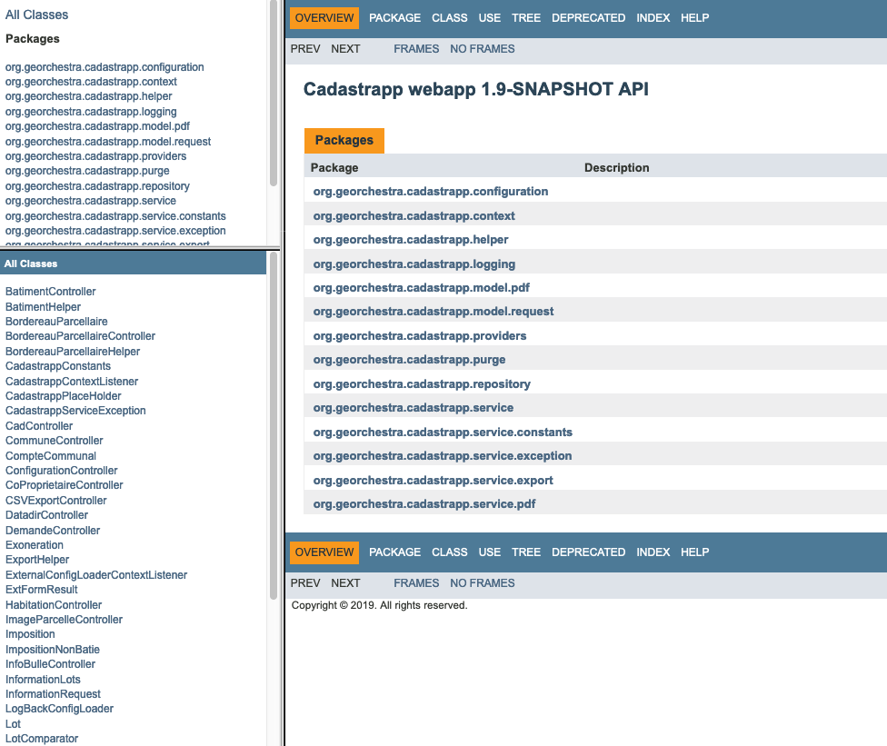

Guide développeur
======================================

.. toctree::
   :maxdepth: 2

 

 
Matrice des fonctionnalités
^^^^^^^^^^^^^^^^^^^^^^^^^^^

+------------------------------------+-----------------------------+--------------+---------------------------------+--------+--------+--------+-----------------------------------------------------------------------------------------+
|  Bloc                              |  Fonctionnalité             |  Responsive  |  Action                         | CNIL 0 | CNIL 1 | CNIL 2 |  Appel API                                                                              |
+====================================+=============================+==============+=================================+========+========+========+=========================================================================================+
|  Rechercher des parcelles          |  Recherche par référence    |      X       |  Sélectionner une commune       |    X   |    X   |    X   |  GET /cadastrapp/services/getCommune                                                    |
+                                    +                             +              +---------------------------------+--------+--------+--------+-----------------------------------------------------------------------------------------+
|                                    |                             |              |  Sélectionner une section       |    X   |    X   |    X   |  GET /cadastrapp/services/getSection?cgocommune={code}                                  |
+                                    +                             +              +---------------------------------+--------+--------+--------+-----------------------------------------------------------------------------------------+
|                                    |                             |              |  Sélectionner une parcelle      |    X   |    X   |    X   |  GET /cadastrapp/services/getDnuplaList?cgocommune={code}&ccopre={code}&ccosec={code}   |
+                                    +-----------------------------+--------------+---------------------------------+--------+--------+--------+-----------------------------------------------------------------------------------------+
|                                    |  Recherche par identifiant  |              |  Chercher une parcelle          |   X    |    X   |    X   |  GET /geoserver/wfs?request=getfeature&version=1.0.0&service=wfs                        |
|                                    |                             |              |  sur le plan                    |        |        |        |  &typename={workspace:layer}&outputFormat=application/json                              |
|                                    |                             |              |                                 |        |        |        |  &cql_filter=geo_parcelle='{code}'                                                      |
+------------------------------------+-----------------------------+--------------+---------------------------------+--------+--------+--------+-----------------------------------------------------------------------------------------+

Documentation de l'API
^^^^^^^^^^^^^^^^^^^^^^

Un fichier `WADL <https://fr.wikipedia.org/wiki/Web_Application_Description_Language>`_ est disponible après installation de la webapp :

https://my_sdi/cadastrapp/apidocs/wadl/application.wadl

Télécharger :download:`le fichier WADL <application.wadl>` pour la version courante.

Javadoc
^^^^^^^

Une documentation Javadoc construite automatiquement est diponible après installation de la webapp :

https://my_sdi/cadastrapp/apidocs/index.html

