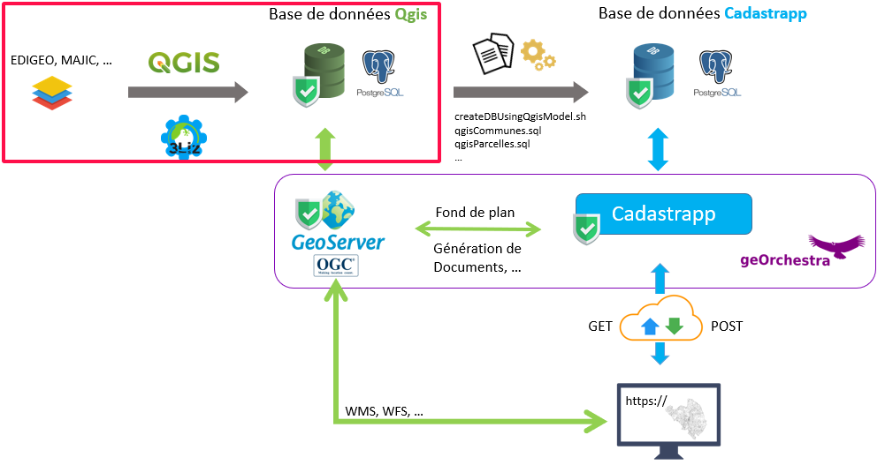
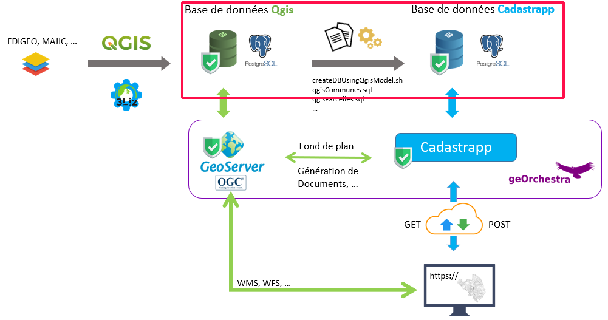

Préparation des données cadastrales
======================================

À propos des données cadastrales en France
------------------------------------------

Le cadastre est un document fiscal qui sert à lever divers impôts et taxes liés au foncier. En France,  la DGFiP met à la disposition des collectivités territoriales les données cadastrales brutes sous la forme de 2 jeux de données séparés :

- des données géographiques : le Plan Cadastral Informatisé (PCI) dans le format EDIGEO
- des données foncières : la matric foncière dans le format MAJIC III

`Consulter cette page <https://www.collectivites-locales.gouv.fr/cadastre-partenaire-des-collectivites-locales>`_ pour plus d'informations.

Données cadastrales au format QGIS
------------------------------------

Créer une base de données
^^^^^^^^^^^^^^^^^^^^^^^^^

**En préalable il faut disposer de données cadastrales traitées par le plugin "cadastre" de QGIS.** 

En synthèse :

#. récupérer des données EDIGEO pour le plan cadastral
#. récupérer des données MAJIC III pour les données foncières
#. traiter ces données avec le plugin cadastre de QGIS

Se reporter à la documentation spécifique du plugin : https://github.com/3liz/QgisCadastrePlugin

Au final, vous devez obtenir des données cadastre au format de données QGIS dans un schéma :code:`cadastre_qgis` dans une base de données PostgreSQL / PostGIS.

Rôle PostgreSQL pour Cadastrapp
^^^^^^^^^^^^^^^^^^^^^^^^^^^^^^^^

Il faut ensuite créer un rôle (utilisateur) PostgreSQL pour que le script de préparation des données pour Cadastrapp puisse accéder en lecture aux données de :code:`cadastre_qgis`.

Exemple : 

.. code:: postgresql 

  CREATE ROLE cadastrapp_user WITH LOGIN PASSWORD 'secretpasswd' ;
  GRANT SELECT ON SCHEMA cadastre_qgis TO cadastrapp_user;
  GRANT SELECT ON TABLE cadastre_qgis.* TO cadastrapp_user;

TODO >>> créer script d'application des permissions <<<

Données cadastrales pour Cadastrapp
------------------------------------

Créer une base de données
^^^^^^^^^^^^^^^^^^^^^^^^^

En fonction de votre infrastructure, les données pour Cadastrapp peuvent être ou ne pas être dans la même base de données que les données cadastales QGIS.

**On partira du principe que les données de Cadastrapp sont hébergées dans une base de données différente de la base de données qui héberge les données cadastrales au format QGIS.**

En tant que postgres, créer la base de données :

.. code:: postgresql

  CREATE DATABASE cadastrapp WITH OWNER = postgres ENCODING = 'UTF8' ;

Sur cette base de données, installer l'extension dblink :

.. code:: postgresql
  
  CREATE EXTENSION dblink ;

Puis créer un rôle de connexion et attribuer les droits sur la base de données :

.. code:: postgresql

  CREATE USER cadastrapp WITH PASSWORD 'secretpasswd' NOSUPERUSER INHERIT NOCREATEDB NOCREATEROLE NOREPLICATION ;
  GRANT ALL PRIVILEGES ON DATABASE cadastrapp TO cadastrapp ;

Charger les données *via* le script
^^^^^^^^^^^^^^^^^^^^^^^^^^^^^^^^^^^^^

On va maintenant charger des données optimisées pour Cadastrapp dans un schéma ::code::`cadastrapp` dans une base de données ::code::`cadastrapp`.

TODO >>> ça suppose qu'on a fait un git-clone AVANT !!! Donc qu'on a déjà installé la webapp <<<

Ouvrir le fichier :code:`/script/qgis/createDBUsingQgisModel.sh` et saisir les paramètres de connexion aux différentes base de données : https://github.com/georchestra/cadastrapp/blob/master/script/qgis/createDBUsingQgisModel.sh#L46-L62

.. code:: bash

  # Postgresql information (the database to load)
  dbhost="localhost"
  dbport="5432"
  # Postgres user which have role creation and schema creation rights
  dbadminuser="admindbuser"
  dbname="cadastrapp"
  schema="cadastrapp"
  username="cadastrapp"
  userpwd="secretpasswd"
  
  # REMOTE QGIS Database information (the database to read)
  qgisDBHost=aserver
  qgisDBPort=5432
  qgisDBName=adb
  qgisDBSchema=cadastre_qgis
  qgisDBUser=cadastrapp_user
  qgisDBPassword=cadastrapp_pwd

TODO >>> batchmode ?? <<<

Sur une machine linux, exécuter ce script.

Conclusion
------------------------------------

On doit à ce stade disposer de 2 sources de données :

- des couches de données géographiques pour GeoServer dans une base PostGIS avec un schéma :code:`cadastre_qgis`
- des données applicatives pour cadastrapp dans une base PostgreSQL avec un schéma :code:`cadastrapp`

TODO >>> faire schéma 2 machines 2 PG 2 schémas <<<