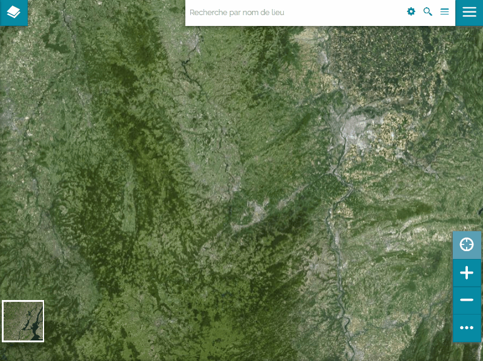

Activation de Cadastrapp
========================

Il y a 2 possibilités :

* Cadastrapp a été préactivé par les administrateurs dans le contexte Mapstore utilisé
* Cadastrapp doit être activé manuellement par l'utilisateur

Cadastrapp est préactivé
------------------------

#. Cliquer sur le menu principal de Mapstore, en haut à droite
#. choisir **Cadastrapp** dans la liste des outils disponibles

L'utilisateur doit activer manuellement Cadastrapp
--------------------------------------------------

Ici les administrateurs ont fait le choix de ne pas préactiver Cadastrapp. Vous devez aller l'activer dans la liste des extensions disponibles.

#. Cliquer sur le menu principal de Mapstore, en haut à droite
#. choisir **Extensions utilisteurs** dans la liste des outils disponibles
#. activer Cadastrapp en cliquant sur la ligne
#. cliquer sur la croix pour fermer la fenêtre

Cadastrapp est maintenant dans la liste des outils disponibles :

#. Cliquer sur le menu principal de Mapstore, en haut à droite
#. choisir **Cadastrapp** dans la liste des outils disponibles