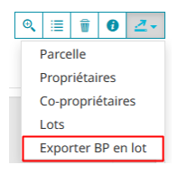

# Bordereau parcellaire

## Création d'un bordereau pour une parcelle

Le bordereau parcellaire est accessible depuis la fenêtre [fiche d'info parcelle(s)](../produire_des_documents/#ficheinfoparcelle) dans l'onglet **Parcelle** en cliquant sur le bouton :

Plusieurs options sont possibles pour éditer un bordereau parcellaire :

- Afficher ou non les données propriétaires (données nominatives) sur le document final en cochant l'option désirée
- Choisir le fond de plan

Il faut ensuite cliquer sur **Exporter** pour générer le document pdf correspondant et l'enregistrer.

Le bordereau parcellaire ci-dessous est sans donnée nominative, si vous avez coché avec données nominatives, l'information du propriétaire apparaît à droite en dessous des informations sur la parcelle.

## Export en lot de bordereaux parcellaires

Cette fonction va créer un seul fichier PDF contenant autant de pages que de parcelles dans votre sélection.

**Attention**

Le temps de production du document PDF va être d'autant plus long que votre sélection sera grande. Il faut donc être patient car aucun indicateur visuel ne vous indique que votre demande est en traitement.
Il est donc recommandé de patienter.
Une limite haute à 50 parcelles est fixée par défaut, afin de ne pas saturer les serveurs.

