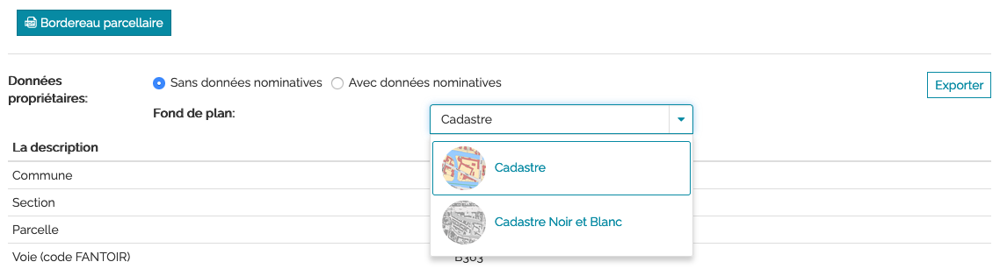
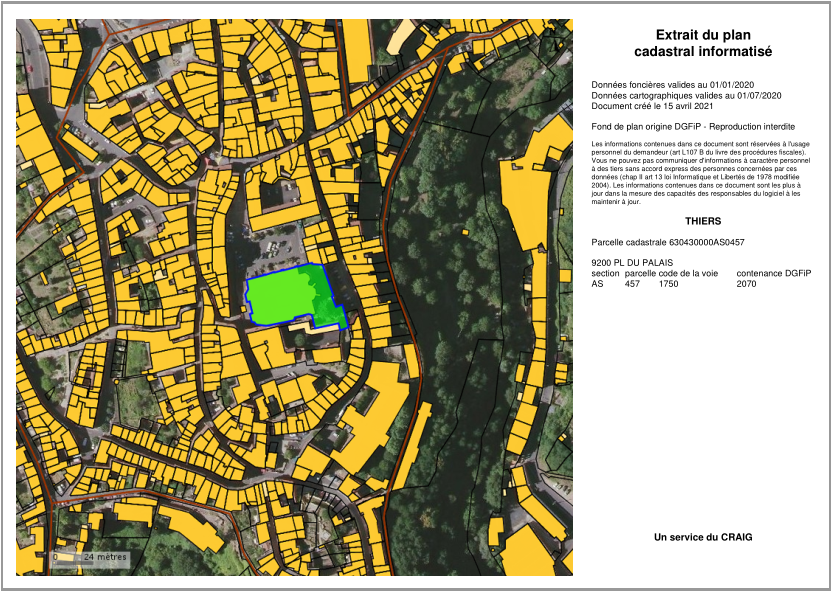

Bordereau parcellaire
======================

Le bordereau parcellaire est accessible depuis la fenêtre `fiche d'info parcelle(s) <fiche_info_parcelle.html>`_ dans l'onglet **Parcelle** en cliquant sur le bouton :

.. image::   _images/bp_bouton.png

Plusieurs options sont possibles pour éditer un bordereau parcellaire :

- Afficher ou non les données propriétaires (données nominatives) sur le document final en cochant l'option désirée
- Choisir le fond de plan

Il faut ensuite cliquer sur **Exporter** pour générer le document pdf correspondant et l'enregistrer.

Le bordereau parcellaire ci-dessous est sans donnée nominative, si vous avez coché avec données nominatives, l'information du propriétaire apparaît à droite en dessous des informations sur la parcelle.

Il est possible de réaliser un export pour toute une liste de parcelles. `Lire ici la procédure <export_selection.html#export-en-lot-de-bordereaux-parcellaires>`_.

