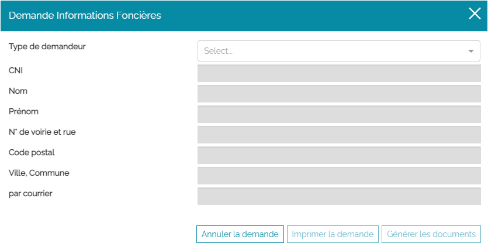
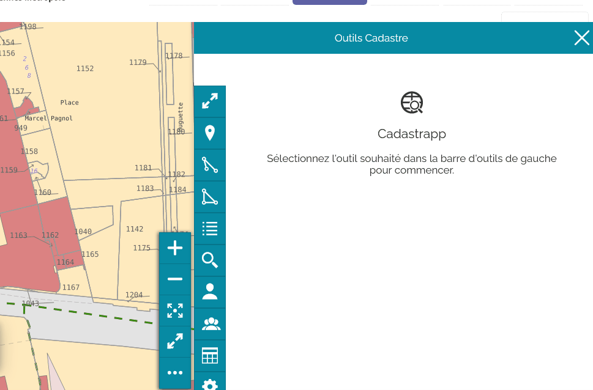

Module des demandes d'information foncière
==============================================

Le module de gestion des demandes d'informations foncières a été conçu pour permettre à une collectivité locale de répondre aux demandes des administrés qui souhaite obtenir des informations sur un bien. Le tout en respectant le cadre légal en vigueur.

Réglementation en vigueur
--------------------------

Une collectivité locale peut si elle le souhaite répondre à des demandes d'information foncière provenant des administrés.

Cette possibilité est permise par `l'article 107 A du Livre des procédures fiscales <https://www.legifrance.gouv.fr/codes/id/LEGIARTI000036588629/>`_.

.. note::
  Toute personne peut obtenir communication ponctuelle, le cas échéant par voie électronique, d'informations relatives aux immeubles situés sur le territoire d'une commune déterminée, ou d'un arrondissement pour la Ville de Paris et les communes de Lyon et Marseille, sur lesquels une personne désignée dans la demande dispose d'un droit réel immobilier. Toute personne peut obtenir, dans les mêmes conditions, communication d'informations relatives à un immeuble déterminé. Les informations communicables sont les références cadastrales, l'adresse ou, le cas échéant, les autres éléments d'identification cadastrale des immeubles, la contenance cadastrale de la parcelle, la valeur locative cadastrale des immeubles, ainsi que les noms et adresses des titulaires de droits sur ces immeubles. Un décret en Conseil d'Etat, pris après avis de la Commission nationale de l'informatique et des libertés, définit les modalités d'application du présent article et les conditions de communication par voie électronique des informations visées à la phrase précédente.

Car il s'agit bien d'une **possibilité** offerte à l'administration communale ou de l'EPCI. Si elle décide de l'appliquer, elle doit s'organiser pour délivrer ces informations aux administrés. Ce n'est absolument pas une obligation et à tout moment elle peut renvoyer les administrés vers les services de la DGFiP car ce sont des missions régaliennes liées directement à l'établissement des impôts.

.. warning::
  Si la commune décide de prendre en charge cette possibilité de délivrance d'informations foncières aux administrés elle doit le faire en respectant les conditions de 2 dispositifs réglementaires :
  
  * `les articles R* 107 A-1 et suivants du livre des procédures fiscales <https://www.legifrance.gouv.fr/codes/section_lc/LEGITEXT000006069583/LEGISCTA000006180153/#LEGISCTA000006180153>`_
  * `l'article L112-3 du Code des relations entre le public et l'administration <https://www.legifrance.gouv.fr/codes/id/LEGIARTI000031367338/>`_

Concrètement :

* l’administré doit formuler une demande écrite mentionnant les biens ou personnes faisant l'objet de la demande ainsi que son identité
* l’administration doit produire un accusé de réception de cette demande
* La demande doit rester ponctuelle : 5 par semaine maxi et 10 par mois maxi

**Ces règles ne valent que pour des demandes de tiers.**

Il n'y a pas de limite pour les propriétaires / ayants-droits, sauf refus pour motif de demandes abusives ou trop fréquentes.

Pas de limites pour des demandes émanant d’administrations (pas de définition…).

**Un notaire** peut être identifié comme mandataire lorsqu'il agit pour le compte d'un représentant légal dans le cadre d'une vente, une tutelle. **Mais pas systématiquement !** Il doit donc bien justifier sa demande.

Accès au module
----------------

Pour ouvrir le module des demandes d'information foncière, cliquer sur le bouton **Demande** :

Une fenêtre s'affiche.

Identification du demandeur
----------------------------

Commencer par compléter les informations du demandeur et en premier lieu son type.
Le demandeur peut-être : 

- une administration;
- un particulier détenteur des droits;
- un particulier agissant en qualité de mandataire;
- un particulier tiers.

Saisir ensuite les informations CNI, nom, prénom et adresse.

Contrôle du nombre de demandes pour les particuliers tiers
-----------------------------------------------------------

Le module, grâce à l'information CNI saisie, calcule le nombre de demandes en cours pour ce particulier, à chaque ajout d'une demande.

Si le nombre maximum d'information pour un demandeur a été atteint, vous ne pourrez pas lui délivrer l'information qu'il demande. Le demandeur devra revenir ultérieurement.

Une demande égale :

* un bordereau parcellaire
* un relevé de propriété pour une parcelle
* un relevé de propriété pour un local

.. warning::
 Si un particulier demande la liste des copropriétaires d'un immeuble… On ne sait pas si cette demande est légitime. Une demande d'éclaicissement est en cours auprès de la DGFiP.
 
Les demandes et leur données sont stockées sur 1 mois flottant pour permettre ce calcul. Elles sont effacées automatiquement ensuite.

Saisie des demandes
---------------------

Une fois les renseignements sur le demandeur saisis, vous pouvez indiquer l'objet de sa demande en choisissant parmi les opérations suivantes : 

- Compte communal;
- Parcelle;
- Co-propriété;
- Identifiant parcellaire;
- Propriétaire;
- Propriétaire (nom de naissance);
- Lot de copropriété.

Plusieurs demandes peuvent être saisies pour un même demandeur en cliquant sur le **+** et en complétant les informations relatives. 

Une ligne peut-etre supprimée avec le bouton **corbeille**

Pour chaque ligne vous devez cocher le(s) document(s) attendu(s) :

- Relevé de propriété;
- Bordereau Parcellaire.

Générer le formulaire de demande
---------------------------------

Avec le bouton **Imprimer la demande**, un PDF synthétisant le rappel de la réglementation en vigueur, l'identité du demandeur ainsi que les demandes est généré.

Ce document est à faire compléter et signer par le demandeur avant de pouvoir lui remettre les documents correspondants à sa demande.

.. warning::
 Ce document papier ne peut être conservé plus de 1 mois courant par l'administration. Sinon cela constituerait un receuil de données à caractère personnel non déclaré auprès de la CNIL, donc illégal.

Générer les documents pour l'administré
----------------------------------------

Une fois que vous avez cliqué sur **Imprimer la demande**, le bouton **Générer les documents** est actif. Un document PDF (de plusieurs pages) correspondant à la demande est produit.

Statistiques
-------------

Des données à but statistique d'exploitation sont stockées dans l'application sous forme anonymisées. Elle peuvent permettre de connaître, par exemple, le nombre de relevé de propriété transmis dans le cadre de l'information foncière.

