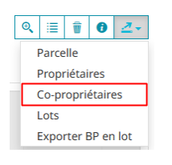
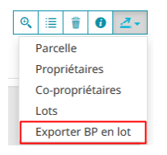

# Export des résultats des sélections

Lorsque l'on dispose d'une sélection de une ou plusieurs parcelles dans le tableau "**Sélection de parcelles**", toutes les commandes permettant de manipuler cette sélection sont activées. Nous allons nous focaliser sur le dernier bouton qui est un bouton qui propose une sous-liste de fonctionnalités lorsque l'on clique dessus :

Cette page détaille les différents exports disponibles.

.. note::
  Les fonctionnalités concernant des données à caractère personnel (comme les noms des propriétaires) ne seront disponibles que si vous disposez d'un `accès à ces données fiscales </guide_utilisateur/preambule.html#controle-du-niveau-d-acces-aux-donnees-fiscales>`_.

## Export de la liste de parcelles

Cette commande provoque la création d'un fichier CSV qui contient la liste des parcelles de votre sélection.

Ce fichier peut ensuite être rechargé ultérieurement afin de refaire une `sélection de parcelles par lot <recherche_parcelle.html#par-lot>`_.

## Export de la liste des propriétaires

Cette commande provoque la création d'un fichier CSV qui contient la liste des "**propriétaires des parcelles**" de votre sélection.

Les informations disponibles dans cet export sont :

- dénomination d'usage du/des propriétaires
- dénomination de naissance du/des propriétaires
- adresse déclarée
- lieu de naissance
- date de naissance

## Export de la liste des copropriétaires

Cette commande provoque la création d'un fichier CSV qui contient la liste des "**copropriétaires des parcelles**" de votre sélection.

Les informations disponibles dans cet export sont :

- dénomination d'usage du/des propriétaires
- dénomination de naissance du/des propriétaires
- adresse déclarée
- lieu de naissance
- date de naissance

## Export de la liste des lots de copropriété

Cette commande provoque la création d'un fichier CSV ou d'un document PDF qui contient la liste des "**lots de copropriété**" de votre sélection.
Ces 2 fichiers sont très différents dans leur forme.

Les informations disponibles dans l'export CSV sont :

- numéro de parcelle
- numéro de local
- identification du bâtiment qui abrite le lot
- part du lot dans le total de la copropriété
- nombre total de parts dans la copropriété
- logement : si le lot est un logement, précise la typologie du logement
- dependance : si le lot est une dépendance, précise la typologie de la dépendance
- local_commercial : si le lot est un local commercial, précise la typologie du local commercial
- type_proprietaire : indique la typologie du droit réel du compte propriétaire du lot
- compte_communal : code du compte communal propriétaire du lot
- dénomination du proprietaire du lot
- adresse déclarée du proprietaire du lot

L'export PDF est une mise en forme beaucoup plus lisible des information brutes du fichier CSV. Il est en outre prêt à être imprimé.

## Export en lot de bordereaux parcellaires

Cette fonction va créer un seul fichier PDF contenant autant de pages que de parcelles dans votre sélection.

.. warning::
  Le temps de production du document PDF va être d'autant plus long que votre sélection sera grande. Il faut donc être patient car aucun indicateur visuel ne vous indique que votre demande est en traitement.
  Il est donc recommandé de patienter.
  Une limite haute à 50 parcelles est fixée par défaut, afin de ne pas saturer les serveurs.
