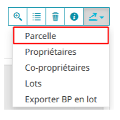
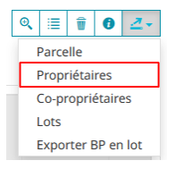
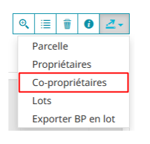
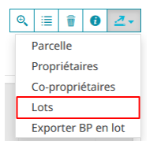
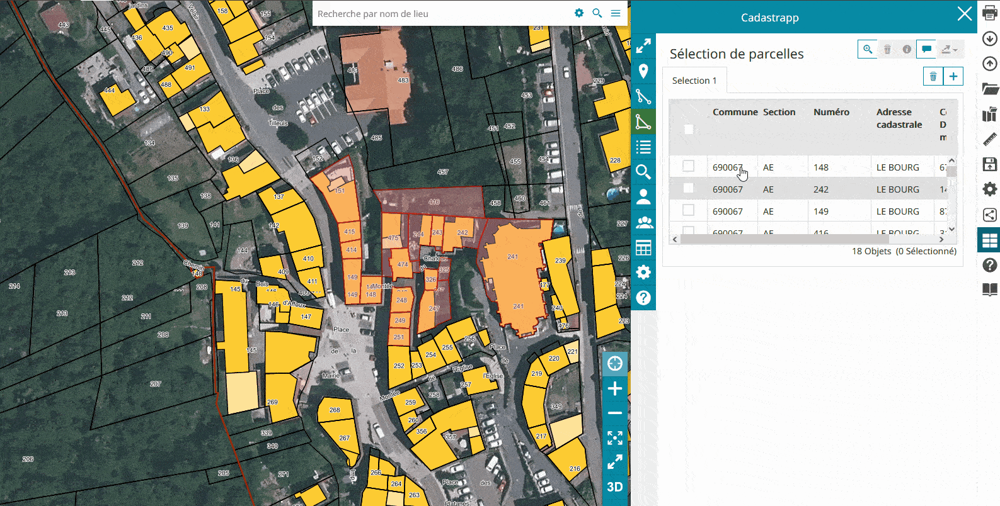
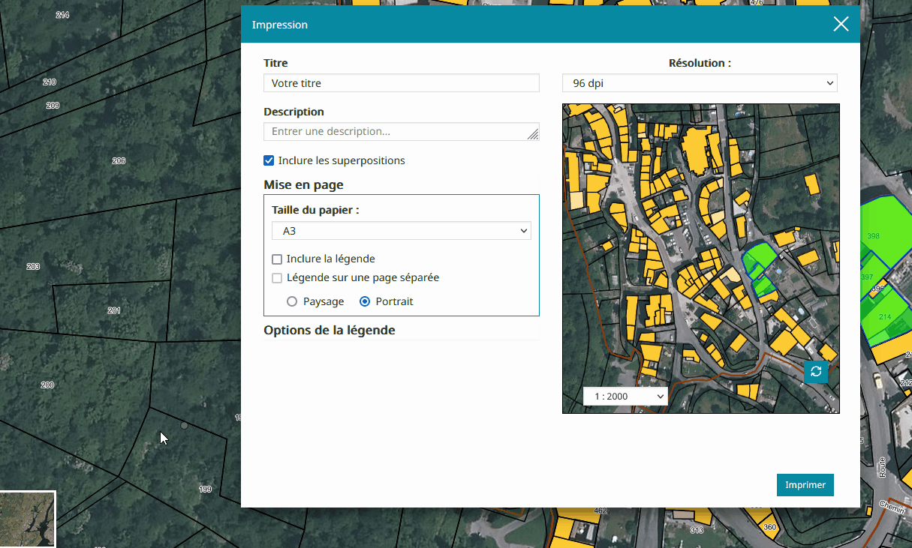
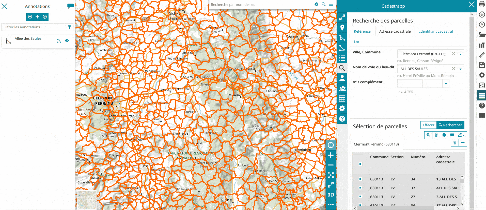

# Exports et impression des résultats des sélections

## Export des résultats des sélections

Lorsque l'on dispose d'une sélection de une ou plusieurs parcelles dans le tableau "**Sélection de parcelles**", toutes les commandes permettant de manipuler cette sélection sont activées. Nous allons nous focaliser sur le dernier bouton qui est un bouton qui propose une sous-liste de fonctionnalités lorsque l'on clique dessus :

Cette page détaille les différents exports disponibles.

.. note::
  Les fonctionnalités concernant des données à caractère personnel (comme les noms des propriétaires) ne seront disponibles que si vous disposez d'un [accès à ces données fiscales](../preambule/#controleniveauaccesdonneesfiscales).

### Export de la liste de parcelles

Cette commande provoque la création d'un fichier CSV qui contient la liste des parcelles de votre sélection.

Ce fichier peut ensuite être rechargé ultérieurement afin de refaire une `sélection de parcelles par lot <recherche_parcelle.html#par-lot>`_.

### Export de la liste des propriétaires

Cette commande provoque la création d'un fichier CSV qui contient la liste des "**propriétaires des parcelles**" de votre sélection.

Les informations disponibles dans cet export sont :

- dénomination d'usage du/des propriétaires
- dénomination de naissance du/des propriétaires
- adresse déclarée
- lieu de naissance
- date de naissance

### Export de la liste des copropriétaires

Cette commande provoque la création d'un fichier CSV qui contient la liste des "**copropriétaires des parcelles**" de votre sélection.

Les informations disponibles dans cet export sont :

- dénomination d'usage du/des propriétaires
- dénomination de naissance du/des propriétaires
- adresse déclarée
- lieu de naissance
- date de naissance

### Export de la liste des lots de copropriété

Cette commande provoque la création d'un fichier CSV ou d'un document PDF qui contient la liste des "**lots de copropriété**" de votre sélection.
Ces 2 fichiers sont très différents dans leur forme.

Les informations disponibles dans l'export CSV sont :

- numéro de parcelle
- numéro de local
- identification du bâtiment qui abrite le lot
- part du lot dans le total de la copropriété
- nombre total de parts dans la copropriété
- logement : si le lot est un logement, précise la typologie du logement
- dependance : si le lot est une dépendance, précise la typologie de la dépendance
- local_commercial : si le lot est un local commercial, précise la typologie du local commercial
- type_proprietaire : indique la typologie du droit réel du compte propriétaire du lot
- compte_communal : code du compte communal propriétaire du lot
- dénomination du proprietaire du lot
- adresse déclarée du proprietaire du lot

L'export PDF est une mise en forme beaucoup plus lisible des information brutes du fichier CSV. Il est en outre prêt à être imprimé.

## Impression et annotations

### Impression d'une sélection

La visionneuse permet également d'imprimer une sélection de parcelles.
Pour cela, cliquer sur l'icône d'impression en haut à droite de l'écran.
Dans la fenêtre d'impression qui s'ouvre, il est possible de renseigner/choisir:

- un titre,
- une description,
- une mise en page (taille du papier, choix de la légende, orientation de la page),
- des options de légende s'il y en a une.

Cliquer ensuite sur le bouton Imprimer.

Il est possible de changer le fond de plan, en cliquant sur  **sélection du fond de plan** en bas à gauche de l'écran.

.. warning::
  Une fois le fond de carte choisi, il faut cliquer sur l'écran de la visionneuse derrière la fenêtre impression pour mettre à jour le fond de plan de la fenêtre d'impression, comme montré dans le gif ci-dessous.

### Annotations

Il est possible d'enregistrer momentanément votre sélection de parcelles, et de l'afficher sous Mapstore avec d'autres données (occupation du sol, orthophoto...)
Pour cela, il faut créer une **annotation**.

- Faire la sélection des parcelles souhaitées, puis sursélectionnez-les en les cochant,
- Cliquer sur l'icône **Enregistrer en tant qu'annotation**,
- Choisir le titre de l'annotation, ainsi que sa description si besoin,
- Cliquer sur **Enregistrer**.

Si la fenêtre de l'outil Cadastrapp est fermée, la sélection est toujours présente sous la forme d'annotation.
Il est possible de la voir en cliquant sur le menu **Couches** en haut à gauche de l'écran Mapstore, comme montré ci-dessous.

Pour ajouter des couches dans Mapstore, en plus de votre sélection de cadastre, cliquer sur l'icône **Ajouter une couche**

Et faire une recherche pour la couche souhaitée.