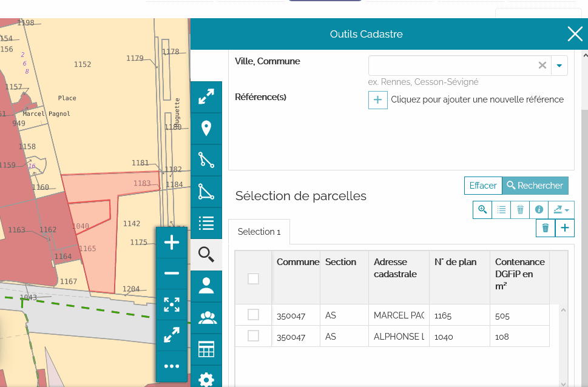
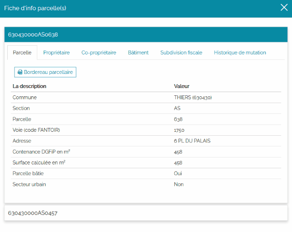
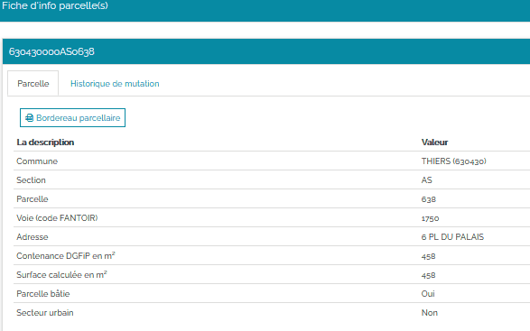
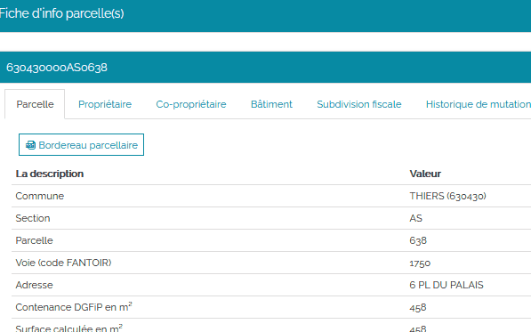

Fiche d'informations des parcelles
====================================

La fiche d'informations sur une parcelle regroupe l'ensemble des informations suivantes :

- Parcelle
- Propriétaire(s)
- Co-propriétaire(s)
- Bâtiment(s)
- Subdivision(s) fiscale(s)
- Historique de mutation

Ouvrir une fiche d'information
-------------------------------

**Il ya 2 manières d'ouvrir une fiche d'information parcellaire.**

La première façon consiste à sur-sélectionner une seule parcelle dans le tableau de résultats des sélections, puis à cliquer sur le bouton qui permet d'afficher la **Fiche d'info parcelle(s)** qui devient alors actif : 

La deuxième façon consiste simplement à double-cliquer sur la ligne qui correspond à la parcelle que l'on veut consulter dans le tableau de résultats des sélections.

Ouvrir plusieurs fiches d'information
--------------------------------------

Pour ouvrir plusieurs fiches d'information en même temps, il faut :

#. Sur-sélectionner les parcelles concernées dans le tableau de résultats des sélections en cochant la case en entête de ligne. Les parcelles concernées sont sélectionnées de la couleur de la sur-sélection sur la carte.
#. Puis cliquer sur le bouton qui permet d'afficher la **Fiche d'info parcelle(s)** qui devient alors actif : 

Une fenêtre s'ouvre alors en mode « accordéon ».

Pour accéder aux informations de chaque parcelle il faut cliquer sur le code de parcelle pour basculer d'une parcelle à l'autre.

Contenu d'une fiche d'information
----------------------------------

La fiche d'info parcelle(s) présente un bandeau avec l'identifiant cadastral correspondant à la parcelle sélectionnée et en dessous plusieurs onglets. 

Les onglets affichés dépendent du `niveau d'accès qui vous a été octroyé <preambule.html#controle-du-niveau-d-acces-aux-donnees-fiscales>`_ par les administrateurs.

+------------------------------+-----------+-----------+-----------+
+  onglet                      | niveau 0  | niveau 1  | niveau 2  |
+==============================+===========+===========+===========+
+  Parcelle                    |     X     |     X     |     X     |
+------------------------------+-----------+-----------+-----------+
+  Propriétaire(s)             |           |     X     |     X     |
+------------------------------+-----------+-----------+-----------+
+  Co-propriétaire(s)          |           |     X     |     X     |
+------------------------------+-----------+-----------+-----------+
+  Bâtiment(s)                 |           |           |     X     |
+------------------------------+-----------+-----------+-----------+
+  Subdivision(s) fiscale(s)   |           |           |     X     |
+------------------------------+-----------+-----------+-----------+
+  Historique de mutation      |     X     |     X     |     X     |
+------------------------------+-----------+-----------+-----------+

Enfin pour fermer la fenêtre Fiche d'info parcelle(s) il suffit de cliquer hors de cette fenêtre ou sur la croix en haut à droite : 

