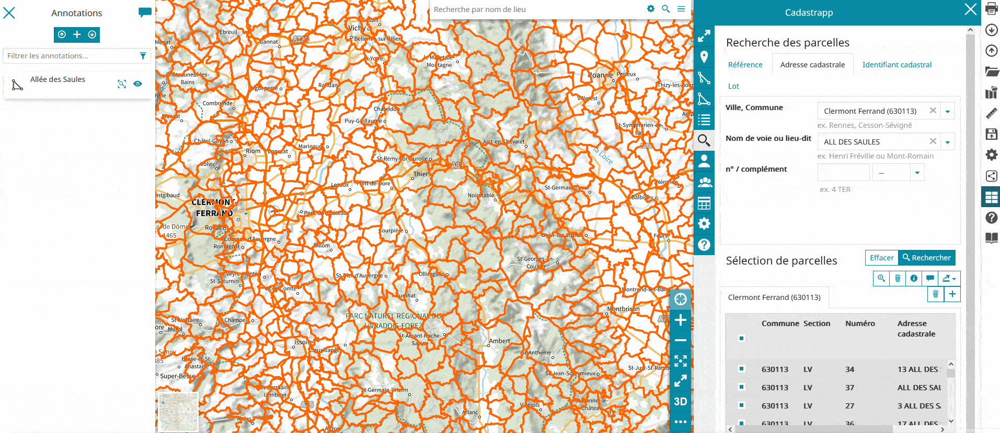

# Impression et annotations

## Impression d'une sélection

La visionneuse permet également d'imprimer une sélection de parcelles.
Pour cela, cliquer sur l'icône d'impression en haut à droite de l'écran.
Dans la fenêtre d'impression qui s'ouvre, il est possible de renseigner/choisir:

- un titre,
- une description,
- une mise en page (taille du papier, choix de la légende, orientation de la page),
- des options de légende s'il y en a une.

Cliquer ensuite sur le bouton Imprimer.

Il est possible de changer le fond de plan, en cliquant sur  **sélection du fond de plan** en bas à gauche de l'écran.

.. warning::
  Une fois le fond de carte choisi, il faut cliquer sur l'écran de la visionneuse derrière la fenêtre impression pour mettre à jour le fond de plan de la fenêtre d'impression, comme montré dans le gif ci-dessous.

## Annotations

Il est possible d'enregistrer momentanément votre sélection de parcelles, et de l'afficher sous Mapstore avec d'autres données (occupation du sol, orthophoto...)
Pour cela, il faut créer une **annotation**.

- Faire la sélection des parcelles souhaitées, puis sursélectionnez-les en les cochant,
- Cliquer sur l'icône **Enregistrer en tant qu'annotation**,
- Choisir le titre de l'annotation, ainsi que sa description si besoin,
- Cliquer sur **Enregistrer**.
	
Si la fenêtre de l'outil Cadastrapp est fermée, la sélection est toujours présente sous la forme d'annotation.
Il est possible de la voir en cliquant sur le menu **Couches** en haut à gauche de l'écran Mapstore, comme montré ci-dessous.

Pour ajouter des couches dans Mapstore, en plus de votre sélection de cadastre, cliquer sur l'icône **Ajouter une couche**

Et faire une recherche pour la couche souhaitée.

