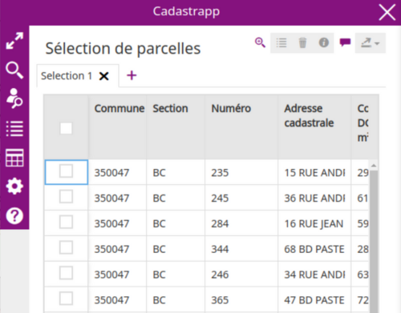
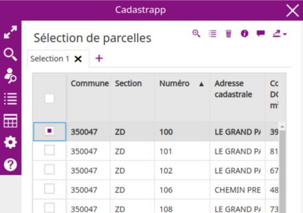

# Afficher les résultats de recherche et les manipuler

Lorsqu'une sélection est effectuée, par interaction avec la carte ou par utilisation des fonctions de recherche, une liste des parcelles apparaît dans le tableau "**Sélection de parcelles**" qui est située dans une zone en-dessous des outils de recherche.

Chaque ligne du tableau correspond à une parcelle sélectionnée sur la carte. Les informations affichées concernent la commune, la section cadastrale, l'adresse cadastrale, le numéro de la parcelle ainsi que la contenance DGFiP exprimée en m².

Il est possible de trier les parcelles sur l'une de ces informations en cliquant sur l'entête de la colonne.

Depuis cette liste, il est possible de zoomer sur tous les parcelles de la liste avec le bouton "**zoom liste**".

En cochant la case en début de ligne, la parcelle correspondante apparaît en sur-sélection sur la carte. Dans l'exemple ci-dessous la liste comprend 5 parcelles dont 1 est sur-sélectionnée.

**Une fois une (ou plusieurs) parcelle(s) sur-sélectionnée(s), les outils suivants sont rendus accessibles :**

De gauche à droite, ces boutons permettent :

- de recadrer la carte sur l'emprise correspondant à toutes les parcelles de la liste 

- d'afficher les informations sur l'unité foncière d'appartenance de la parcelle sélectionnée

- de supprimer la parcelle sélectionnée de la liste

- d'afficher la fiche d'information parcellaire dans une nouvelle fenêtre

- d'exporter dans un fichier CSV la sélection de :
  
  - parcelles
  - propriétaires
  - co-propriétaires
  - lots d'une co-propriété

La barre d'outils placée juste au-dessus de la liste est composée des 2 outils suivants, permettant de supprimer un onglet de résultat de sélection ou d'en ajouter un.

