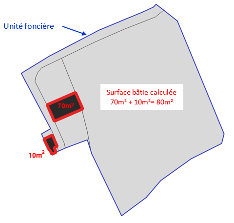
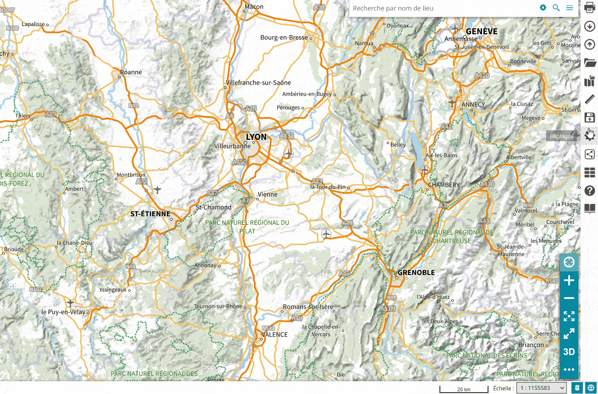
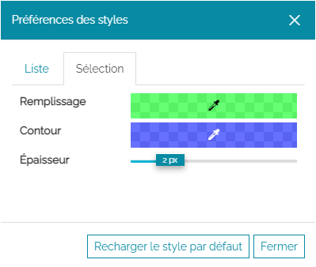

# Avant de démarrer

Cadastrapp est un outil conçu pour permettre l'exploitation des [données cadastrales](../guides_techniques/administrer/donnees_dgfip.md)  fournies par la [DGFiP](https://www.economie.gouv.fr/dgfip/presentation) aux collectivités territoriales.

Si la consultation du plan cadastral (la carte visible) ne connaît pas de restrictions, l'accès aux informations se rapportant aux bâtiments, aux propriétaires et aux autres informations fiscales nécessite d'être authentifié sur la plateforme geOrchestra.

## Contrôle du niveau d'accès aux données fiscales

**Par défaut un compte utilisateur n'est pas doté des accès permettant l'accès aux données sensibles contenues dans les données cadastrales. La matrice foncière contient en effet des données à caractère personnel et des données fiscales.** Les administrateurs doivent donc configurer votre compte pour que Cadastrapp vous laisse accéder à ces informations.

Il y a 2 types de limitations d'accès :

- le niveau :
    - niveau 0 : aucun accès aux données fiscales
    - niveau 1 : accès uniquement aux noms d'usage des propriétaires
    - niveau 2 : accès à toutes les données

- l'emprise géographique : vous ne pouvez accéder aux données que pour votre territoire de compétence

Pour tout changement ou demande d’accès aux informations sur les propriétaires, contacter les administrateurs de la plate-forme geOrchestra.

## Vocabulaire / Lexique

### Les différentes surfaces des parcelles

**Contenance DGFiP** (ou surface DGFiP) : surface enregistrée dans les fichiers fonciers BATI et NBAT;

**Surface calculée** : superficie calculée par l'application à partir de la forme des parcelles ou des bâtiments issus du plan cadastral;

## Unité foncière

Îlot de propriété d'un seul tenant, composé d'une parcelle ou d'un ensemble de parcelles appartenant à un même propriétaire ou à la même indivision.

La surface parcellaire calculée correspond à la surface géométrique de la parcelle. 
La surface bâtie calculée correspond à la surface géométrique totale des bâtiments compris dans l'unité foncière.

### Propriétaire -> compte communal

Dans le cadastre, les entités qui possèdent des droits sur des biens (des parcelles ou des lots de copropriété) sont les comptes communaux.

Un compte communal est composé de l’ensemble des personnes physiques ou morales exerçant des droits concurrents sur un ou plusieurs biens d’une commune. Un compte communal est composé de 1 à 8 propriétaires.

### Copropriété

Une copropriété est un ou plusieurs lots dans un immeuble appartenant à plusieurs comptes communaux. 

Généralement, dans un immeuble, chaque copropriétaire dispose de parties privatives et d'une quote-part de parties communes appelée « tantièmes de copropriété ».

### CSV

Comma-Separated Values, connu sous le sigle CSV, est un format texte ouvert représentant des données tabulaires sous forme de valeurs séparées par un séparateur, le plus souvent une virgule.

## Activation de Cadastrapp

Il y a 2 possibilités :

* Cadastrapp a été préactivé par les administrateurs dans le contexte Mapstore utilisé
* Cadastrapp doit être activé manuellement par l'utilisateur

### Cadastrapp est préactivé

Cliquer sur l'icône correspondant à **Cadastrapp** sur la barre de menus latérale listant les différents outils disponibles.

### L'utilisateur doit activer manuellement Cadastrapp

Ici les administrateurs ont fait le choix de ne pas préactiver Cadastrapp. Vous devez aller l'activer dans la liste des extensions disponibles.

1. Cliquer sur le menu principal de Mapstore, en haut à droite,
1. choisir **Extensions utilisteurs** dans la liste des outils disponibles,
1. activer Cadastrapp en cliquant sur la ligne,
1. cliquer sur la croix pour fermer la fenêtre.

Cadastrapp est maintenant dans la liste des outils disponibles :

1. Cliquer sur le menu principal de Mapstore, en haut à droite
1. choisir **Cadastrapp** dans la liste des outils disponibles

## Préférences de l'application

Il s'agit ici de modifier les couleurs d'affichage des parcelles depuis le bouton **Préférences**:

La fenêtre **Préférences des styles** permet de choisir :

- la couleur d'une parcelle figurant dans la fenêtre sélection de parcelles avec l'onglet **Liste**;
- la couleur d'une parcelle sélectionnée ou cochée dans la fenêtre sélection de parcelles avec l'onglet **Sélection**.

Pour chaque onglet, vous pouvez choisir  :

- la couleur du remplissage ainsi que la transparence,
- la couleur et la transparence du contour,
- l'épaisseur du contour.

En cliquant sur **Fermer** vous conservez les valeurs choisies.

 

