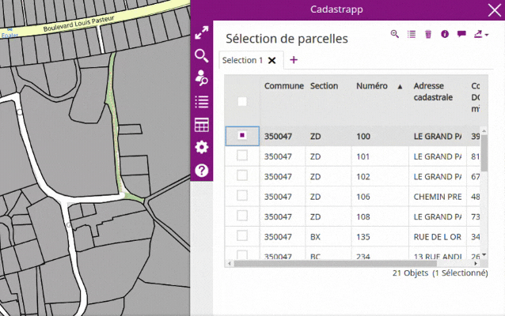
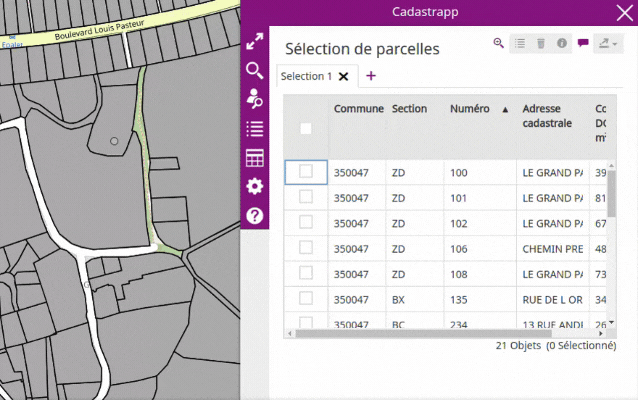
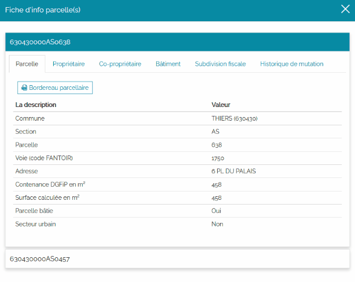
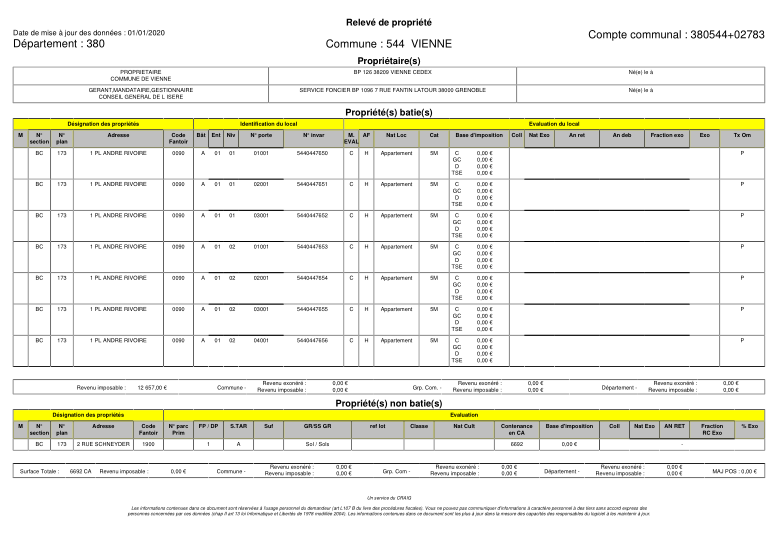
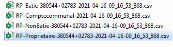
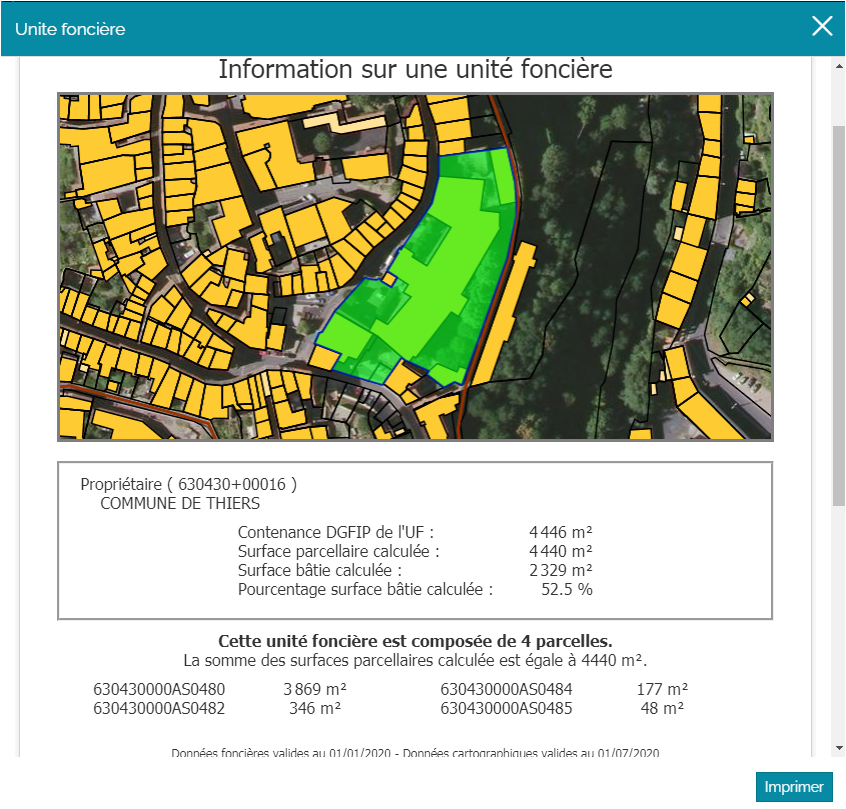
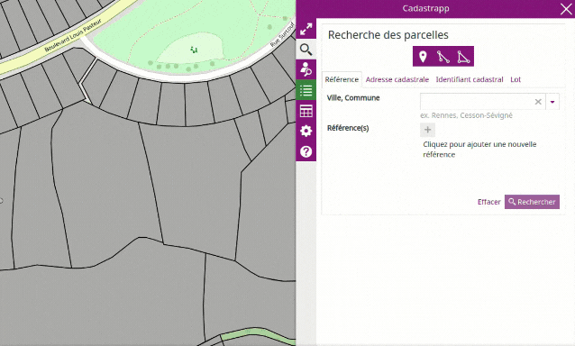
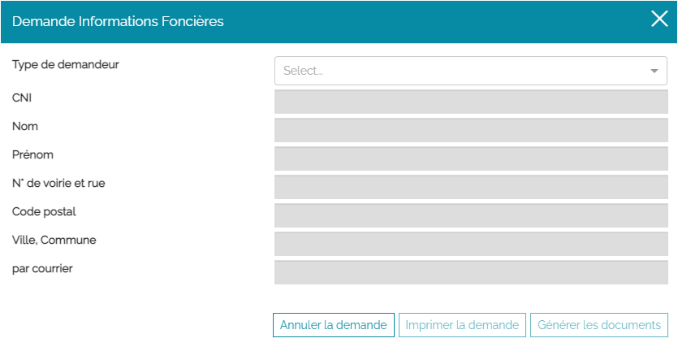
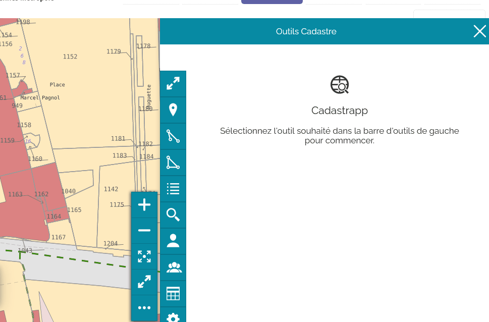

# Produire des documents

## Fiche d'informations des parcelles

La fiche d'informations sur une parcelle regroupe l'ensemble des informations suivantes :

- Parcelle
- Propriétaire(s)
- Co-propriétaire(s)
- Bâtiment(s)
- Subdivision(s) fiscale(s)
- Historique de mutation

### Ouvrir une fiche d'information

**Il y a 2 manières d'ouvrir une fiche d'information parcellaire.**

La première façon consiste à sur-sélectionner une seule parcelle dans le tableau de résultats des sélections, puis à cliquer sur le bouton qui permet d'afficher la **Fiche d'info parcelle(s)** qui devient alors actif : 

La deuxième façon consiste simplement à double-cliquer sur la ligne qui correspond à la parcelle que l'on veut consulter dans le tableau de résultats des sélections.

### Ouvrir plusieurs fiches d'information

Pour ouvrir plusieurs fiches d'information en même temps, il faut :

1. Sur-sélectionner les parcelles concernées dans le tableau de résultats des sélections en cochant la case en entête de ligne. Les parcelles concernées sont sélectionnées de la couleur de la sur-sélection sur la carte.
1. Puis cliquer sur le bouton qui permet d'afficher la **Fiche d'info parcelle(s)** qui devient alors actif : 

Une fenêtre s'ouvre alors en mode « accordéon ».

Pour accéder aux informations de chaque parcelle il faut cliquer sur le code de parcelle pour basculer d'une parcelle à l'autre.

### Contenu d'une fiche d'information

La fiche d'info parcelle(s) présente un bandeau avec l'identifiant cadastral correspondant à la parcelle sélectionnée et en dessous plusieurs onglets. 

Les onglets affichés dépendent du [niveau d'accès qui vous a été octroyé](../preambule/#controleniveauaccesdonneesfiscales) par les administrateurs.

|  onglet                      | niveau 0  | niveau 1  | niveau 2  |
|------------------------------|-----------|-----------|-----------|
|  Parcelle                    |     X     |     X     |     X     |
|  Propriétaire(s)             |           |     X     |     X     |
|  Co-propriétaire(s)          |           |     X     |     X     |
|  Bâtiment(s)                 |           |           |     X     |
|  Subdivision(s) fiscale(s)   |           |           |     X     |
|  Historique de mutation      |     X     |     X     |     X     |

Enfin pour fermer la fenêtre Fiche d'info parcelle(s) il suffit de cliquer hors de cette fenêtre ou sur la croix en haut à droite : 

## Relevé de propriété

Le relevé de propriété peut être généré depuis la  [fiche d'info parcelle(s)](#ficheinfoparcelle) dans l'onglet **Propriétaire** en cliquant sur le bouton :

Ce bouton est actif uniquement si vous avez sélectionné une (ou plusieurs) ligne(s) dans le tableau propriétaire. 

Vous devez ensuite choisir :

- entre **Uniquement cette parcelle** ou **Toutes les propriétés** de ce propriétaire pour générer le relevé de propriété,
- le format du relevé de propriété soit un document pdf, soit un fichier texte au format CSV.

Le document est généré lorsque vous cliquez sur le bouton **Exporter**. 

Un relevé de propriété au format PDF :

Pour le format CSV, on obtient un zip contenant 4 fichiers correspondant aux informations  contenues dans un relevé de propriété. 

## Unité foncière

Une unité foncière est un îlot de propriété d'un seul tenant, composé d'une parcelle ou d'un ensemble de parcelles appartenant à un même propriétaire ou à la même indivision.

## Unité foncière depuis les outils principaux

Pour identifier l'unité foncière correspondant à une parcelle, il est nécessaire d'activer l'outil d'information foncière.

Cliquer ensuite dans la carte sur une parcelle.

Une nouvelle fenêtre **Unité foncière** apparaît. Elle permet de visualiser l'ensemble de(s) parcelle(s) composant l'unité foncière, de lister les identifiants cadastraux des différentes parcelles ainsi que leur contenance et le pourcentage de surface bâtie.

Le nom du propriétaire ainsi que l'identifiant du compte propriétaire apparaissent seulement si vous avez [accès aux données nominatives ](../preambule/#controleniveauaccesdonneesfiscales).

En pied de page, il est précisé les dates de fraîcheur des données du plan et de la matrice cadastrale.

  

Il est possible d'**Imprimer** directement le document Information sur l'unité foncière.

### Unité foncière depuis une sélection

Après une sélection graphique ou une recherche, il est possible de cocher une ligne du tableau sélection de parcelles et d'afficher l'unité foncière correspondante depuis le bouton : 

## Module des demandes d'information foncière

Le module de gestion des demandes d'informations foncières a été conçu pour permettre à une collectivité locale de répondre aux demandes des administrés qui souhaite obtenir des informations sur un bien. Le tout en respectant le cadre légal en vigueur.

### Réglementation en vigueur

Une collectivité locale peut si elle le souhaite répondre à des demandes d'information foncière provenant des administrés.

Cette possibilité est permise par `l'article 107 A du Livre des procédures fiscales <https://www.legifrance.gouv.fr/codes/id/LEGIARTI000036588629/>`_.

> **Note**

  Toute personne peut obtenir communication ponctuelle, le cas échéant par voie électronique, d'informations relatives aux immeubles situés sur le territoire d'une commune déterminée, ou d'un arrondissement pour la Ville de Paris et les communes de Lyon et Marseille, sur lesquels une personne désignée dans la demande dispose d'un droit réel immobilier. Toute personne peut obtenir, dans les mêmes conditions, communication d'informations relatives à un immeuble déterminé. Les informations communicables sont les références cadastrales, l'adresse ou, le cas échéant, les autres éléments d'identification cadastrale des immeubles, la contenance cadastrale de la parcelle, la valeur locative cadastrale des immeubles, ainsi que les noms et adresses des titulaires de droits sur ces immeubles. Un décret en Conseil d'Etat, pris après avis de la Commission nationale de l'informatique et des libertés, définit les modalités d'application du présent article et les conditions de communication par voie électronique des informations visées à la phrase précédente.

Car il s'agit bien d'une **possibilité** offerte à l'administration communale ou de l'EPCI. Si elle décide de l'appliquer, elle doit s'organiser pour délivrer ces informations aux administrés. Ce n'est absolument pas une obligation et à tout moment elle peut renvoyer les administrés vers les services de la DGFiP car ce sont des missions régaliennes liées directement à l'établissement des impôts.

> **Warning**

  Si la commune décide de prendre en charge cette possibilité de délivrance d'informations foncières aux administrés elle doit le faire en respectant les conditions de 2 dispositifs réglementaires :
  
  * `les articles R* 107 A-1 et suivants du livre des procédures fiscales <https://www.legifrance.gouv.fr/codes/section_lc/LEGITEXT000006069583/LEGISCTA000006180153/#LEGISCTA000006180153>`_
  * `l'article L112-3 du Code des relations entre le public et l'administration <https://www.legifrance.gouv.fr/codes/id/LEGIARTI000031367338/>`_

Concrètement :

* l’administré doit formuler une demande écrite mentionnant les biens ou personnes faisant l'objet de la demande ainsi que son identité
* l’administration doit produire un accusé de réception de cette demande
* La demande doit rester ponctuelle : 5 par semaine maxi et 10 par mois maxi

**Ces règles ne valent que pour des demandes de tiers.**

Il n'y a pas de limite pour les propriétaires / ayants-droits, sauf refus pour motif de demandes abusives ou trop fréquentes.

Pas de limites pour des demandes émanant d’administrations (pas de définition…).

**Un notaire** peut être identifié comme mandataire lorsqu'il agit pour le compte d'un représentant légal dans le cadre d'une vente, une tutelle. **Mais pas systématiquement !** Il doit donc bien justifier sa demande.

### Accès au module

Pour ouvrir le module des demandes d'information foncière, cliquer sur le bouton **Demande** :

Une fenêtre s'affiche.

### Identification du demandeur

Commencer par compléter les informations du demandeur et en premier lieu son type.
Le demandeur peut-être : 

- une administration,
- un particulier détenteur des droits,
- un particulier agissant en qualité de mandataire,
- un particulier tiers.

Saisir ensuite les informations CNI, nom, prénom et adresse.

### Contrôle du nombre de demandes pour les particuliers tiers

Le module, grâce à l'information CNI saisie, calcule le nombre de demandes en cours pour ce particulier, à chaque ajout d'une demande.

Si le nombre maximum d'information pour un demandeur a été atteint, vous ne pourrez pas lui délivrer l'information qu'il demande. Le demandeur devra revenir ultérieurement.

Une demande égale :

* un bordereau parcellaire
* un relevé de propriété pour une parcelle
* un relevé de propriété pour un local

**_WARNING:_**

 Si un particulier demande la liste des copropriétaires d'un immeuble… On ne sait pas si cette demande est légitime. Une demande d'éclaicissement est en cours auprès de la DGFiP.
 
Les demandes et leur données sont stockées sur 1 mois flottant pour permettre ce calcul. Elles sont effacées automatiquement ensuite.

### Saisie des demandes

Une fois les renseignements sur le demandeur saisis, vous pouvez indiquer l'objet de sa demande en choisissant parmi les opérations suivantes : 

- Compte communal;
- Parcelle;
- Co-propriété;
- Identifiant parcellaire;
- Propriétaire;
- Propriétaire (nom de naissance);
- Lot de copropriété.

Plusieurs demandes peuvent être saisies pour un même demandeur en cliquant sur le **+** et en complétant les informations relatives. 

Une ligne peut-etre supprimée avec le bouton **corbeille**

Pour chaque ligne vous devez cocher le(s) document(s) attendu(s) :

- Relevé de propriété;
- Bordereau Parcellaire.

### Générer le formulaire de demande

Avec le bouton **Imprimer la demande**, un PDF synthétisant le rappel de la réglementation en vigueur, l'identité du demandeur ainsi que les demandes est généré.

Ce document est à faire compléter et signer par le demandeur avant de pouvoir lui remettre les documents correspondants à sa demande.

**_WARNING:_**
 Ce document papier ne peut être conservé plus de 1 mois courant par l'administration. Sinon cela constituerait un receuil de données à caractère personnel non déclaré auprès de la CNIL, donc illégal.

### Générer les documents pour l'administré

Une fois que vous avez cliqué sur **Imprimer la demande**, le bouton **Générer les documents** est actif. Un document PDF (de plusieurs pages) correspondant à la demande est produit.

### Statistiques

Des données à but statistique d'exploitation sont stockées dans l'application sous forme anonymisées. Elle peuvent permettre de connaître, par exemple, le nombre de relevé de propriété transmis dans le cadre de l'information foncière.
