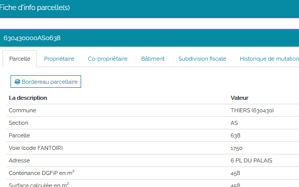

# Produire des documents

## Fiche d'informations des parcelles

La fiche d'informations sur une parcelle regroupe l'ensemble des informations suivantes :

- Parcelle
- Propriétaire(s)
- Co-propriétaire(s)
- Bâtiment(s)
- Subdivision(s) fiscale(s)
- Historique de mutation

### Ouvrir une fiche d'information

**Il y a 2 manières d'ouvrir une fiche d'information parcellaire.**

La première façon consiste à sur-sélectionner une seule parcelle dans le tableau de résultats des sélections, puis à cliquer sur le bouton qui permet d'afficher la **Fiche d'info parcelle(s)** qui devient alors actif : 

La deuxième façon consiste simplement à double-cliquer sur la ligne qui correspond à la parcelle que l'on veut consulter dans le tableau de résultats des sélections.

### Ouvrir plusieurs fiches d'information

Pour ouvrir plusieurs fiches d'information en même temps, il faut :

1. Sur-sélectionner les parcelles concernées dans le tableau de résultats des sélections en cochant la case en entête de ligne. Les parcelles concernées sont sélectionnées de la couleur de la sur-sélection sur la carte.
1. Puis cliquer sur le bouton qui permet d'afficher la **Fiche d'info parcelle(s)** qui devient alors actif : 

Une fenêtre s'ouvre alors en mode « accordéon ».

Pour accéder aux informations de chaque parcelle il faut cliquer sur le code de parcelle pour basculer d'une parcelle à l'autre.

### Contenu d'une fiche d'information

La fiche d'info parcelle(s) présente un bandeau avec l'identifiant cadastral correspondant à la parcelle sélectionnée et en dessous plusieurs onglets. 

Les onglets affichés dépendent du [niveau d'accès qui vous a été octroyé](../preambule/#controleniveauaccesdonneesfiscales) par les administrateurs.

|  onglet                      | niveau 0  | niveau 1  | niveau 2  |
|------------------------------|-----------|-----------|-----------|
|  Parcelle                    |     X     |     X     |     X     |
|  Propriétaire(s)             |           |     X     |     X     |
|  Co-propriétaire(s)          |           |     X     |     X     |
|  Bâtiment(s)                 |           |           |     X     |
|  Subdivision(s) fiscale(s)   |           |           |     X     |
|  Historique de mutation      |     X     |     X     |     X     |

Enfin pour fermer la fenêtre Fiche d'info parcelle(s) il suffit de cliquer hors de cette fenêtre ou sur la croix en haut à droite : 

## Relevé de propriété

Le relevé de propriété peut être généré depuis la  [fiche d'info parcelle(s)](#ficheinfoparcelle) dans l'onglet **Propriétaire** en cliquant sur le bouton :

Ce bouton est actif uniquement si vous avez sélectionné une (ou plusieurs) ligne(s) dans le tableau propriétaire. 

Vous devez ensuite choisir :

- entre **Uniquement cette parcelle** ou **Toutes les propriétés** de ce propriétaire pour générer le relevé de propriété,
- le format du relevé de propriété soit un document pdf, soit un fichier texte au format CSV.

Le document est généré lorsque vous cliquez sur le bouton **Exporter**. 

Un relevé de propriété au format PDF :

Pour le format CSV, on obtient un zip contenant 4 fichiers correspondant aux informations  contenues dans un relevé de propriété. 

## Unité foncière

Voir la définition sur [cette page](/guide_utilisateur/preambule/#unite-fonciere).

## Unité foncière depuis les outils principaux

Pour identifier l'unité foncière correspondant à une parcelle, il est nécessaire d'activer l'outil d'information foncière.

Cliquer ensuite dans la carte sur une parcelle.

Une nouvelle fenêtre **Unité foncière** apparaît. Elle permet de visualiser l'ensemble de(s) parcelle(s) composant l'unité foncière, de lister les identifiants cadastraux des différentes parcelles ainsi que leur contenance et le pourcentage de surface bâtie.

Le nom du propriétaire ainsi que l'identifiant du compte propriétaire apparaissent seulement si vous avez [accès aux données nominatives ](../preambule/#controleniveauaccesdonneesfiscales).

En pied de page, il est précisé les dates de fraîcheur des données du plan et de la matrice cadastrale.

  

Il est possible d'**Imprimer** directement le document Information sur l'unité foncière.

### Unité foncière depuis une sélection

Après une sélection graphique ou une recherche, il est possible de cocher une ligne du tableau sélection de parcelles et d'afficher l'unité foncière correspondante depuis le bouton : 

