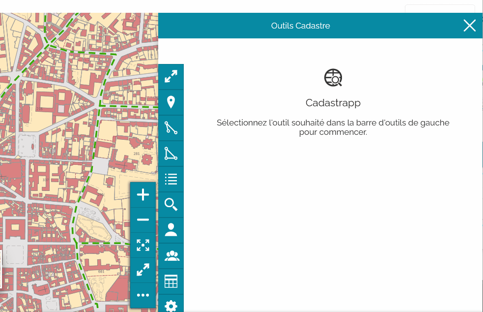
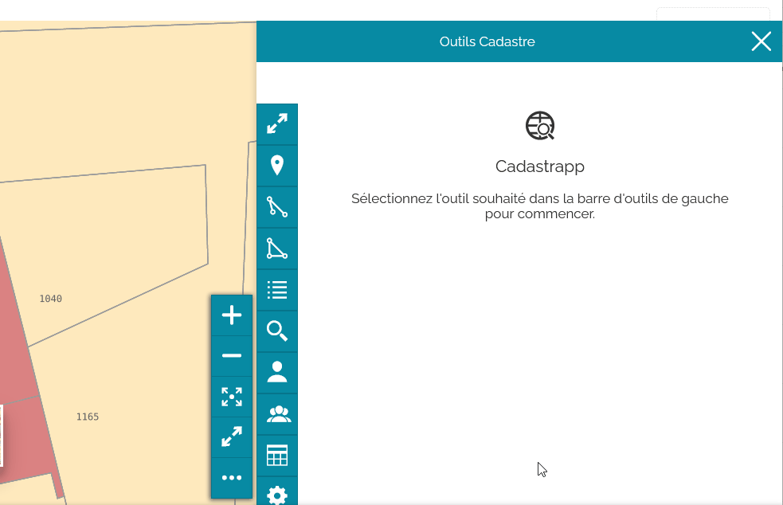
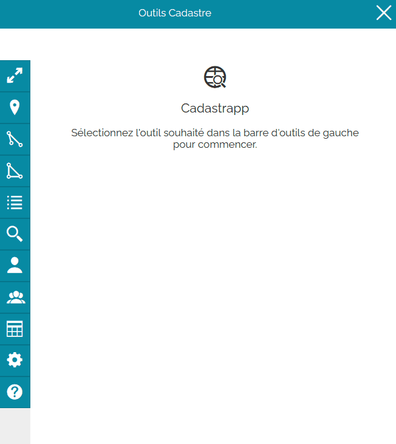

Recherche de parcelles à partir des copropriétaires
===================================================

La recherche de copropriétaires s'obtient avec le bouton :

Qu'est-ce qu'une copropriété ?
-------------------------------

Lire `cette section <preambule.html#proprietaire-compte-communal>`_ pour comprendre la définition d'une copropriété.

Les types de recherche possibles
-----------------------------------------

Plusieurs types de recherche sont possibles en fonction des informations connues. Il faut, a minima, saisir la commune et un des éléments suivant :

- nom et/ou prénom d'un co-propriétaire 
- identifiant de la parcelle
- compte communal

Recherche par nom et/ou prénom d'un copropriétaire
---------------------------------------------------

Après avoir choisi une commune, commencer à saisir le nom du co-propriétaire et le sélectionner dans la liste ou sortir de la liste des propositions  en appuyant sur le bouton « Echap » du clavier.

TODO : gif animé

Valider la recherche en cliquant sur le bouton **Rechercher**

.. image::   _images/recherche_parc2.png

Recherche par identifiant de la parcelle
----------------------------------------

Après avoir choisi une commune, saisir (ou copier-coller) l'identifiant de la parcelle.

TODO : refaire gif animé qui impiète sur le traitement des résultats

Valider la recherche en cliquant sur le bouton **Rechercher**

.. image::   _images/recherche_parc2.png

Recherche par compte communal
--------------------------------------

Après avoir choisi une commune, saisir (ou copier-coller) le compte communal.

TODO : refaire gif animé qui impiète sur le traitement des résultats

Valider la recherche en cliquant sur le bouton **Rechercher**

.. image::   _images/recherche_parc2.png

Résultat d'une sélection
--------------------------------------
Lorsqu'une sélection est effectuée, la liste des parcelles apparaît dans le tabeau "**Sélection de parcelles**"

Passer maintenant à la page détaillant la `manipulation des résultats des sélections <resultat_selection.html>`_.