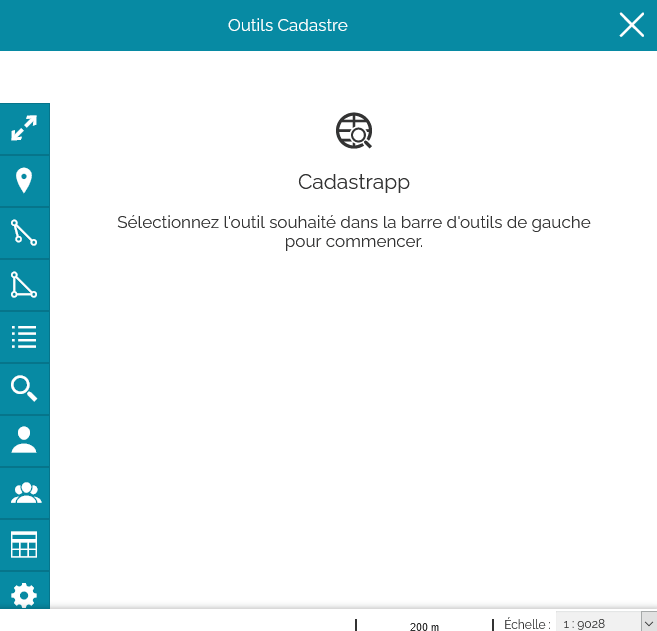
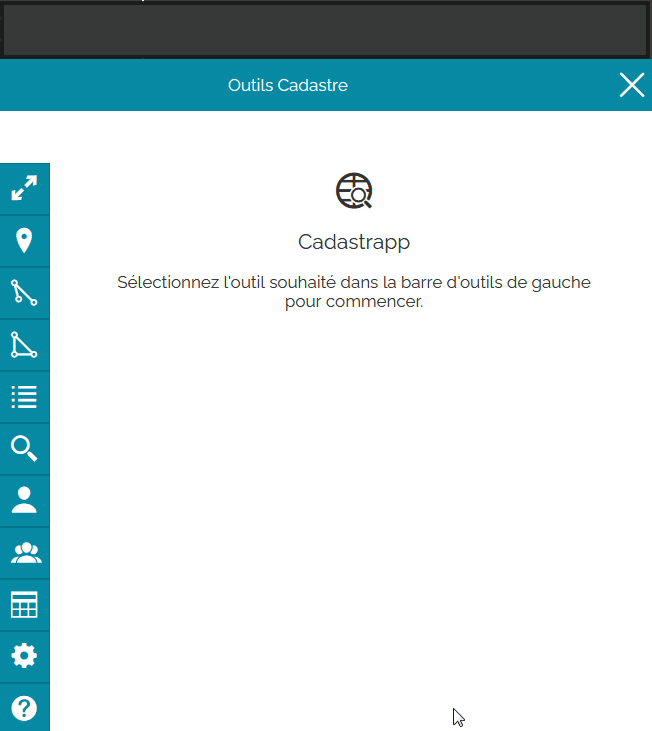
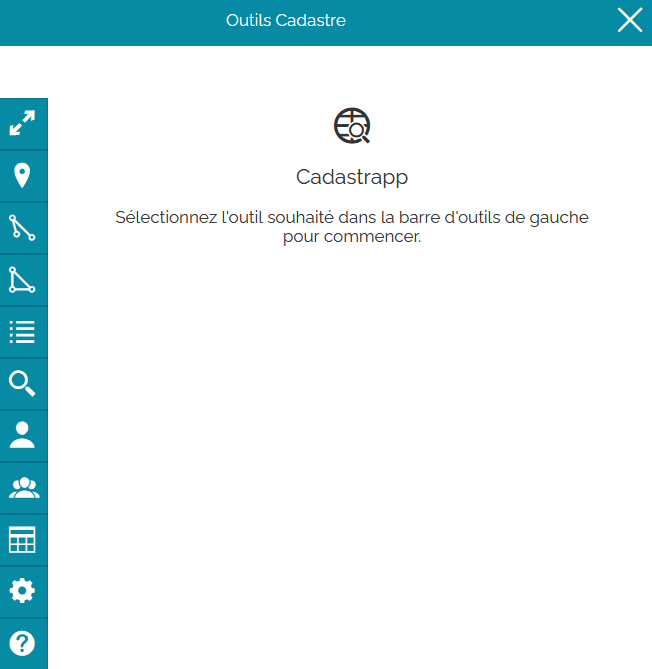
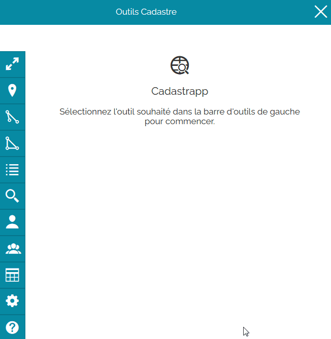

Recherche de parcelles à partir des propriétaires
=================================================

La recherche de propriétaires s'obtient avec le bouton :

Plusieurs types de recherche sont possibles en fonction des informations connues : 

- nom du propriétaire : nom d'usage ou nom de naissance
- compte propriétaire
- une liste de comptes propriétaires

Á chacune de ces possibilités correspond un onglet différent.

Propriétaire -> compte communal
-------------------------------

Lire `cette section <preambule.html#proprietaire-compte-communal>`_ pour comprendre la différence entre un propriétaire et un compte communal.

Recherche par le nom du propriétaire
--------------------------------------

Cas simple
^^^^^^^^^^^^^^^^

Il faut d'abord saisir le nom de la commune sur laquelle effectuer la recherche grâce à la liste déroulante.

Saisir ensuite le nom et / ou le prénom du propriétaire recherché. **Une liste de suggestions apparaît. Elle est affinée à chaque caractère supplémentaire saisi.**

Si le nom du propriétaire désiré apparaît : le sélectionner puis valider la recherche en cliquant sur le bouton **Rechercher**.

Vous pouvez ré-initialiser la fenêtre de recherche en cliquant sur le bouton **Effacer**

Cas des homonymies / Sortie de la recherche assistée
^^^^^^^^^^^^^^^^^^^^^^^^^^^^^^^^^^^^^^^^^^^^^^^^^^^^^^^^^^^^

Si vous ne trouvez pas / pas facilement le propriétaire recherché dans la liste déroulante, vous pouvez sortir du mode assisté de la liste en appuyant sur le bouton « Echap » du clavier.

Valider ensuite la recherche en cliquant sur le bouton **Rechercher**.

Une nouvelle fenêtre va s'ouvrir. Elle présente la liste des propriétaires correspondant à la chaîne de caractères recherchée.

Il faut ensuite sélectionner le propriétaire souhaité puis cliquer sur **Voir les parcelles**.

Vous pouvez ré-initialiser la fenêtre de recherche en cliquant sur le bouton **Effacer**

Recherche par le compte propriétaire
--------------------------------------

Depuis l'onglet Compte Propriétaire, il faut commencer par saisir le nom de la commune sur laquelle effectuer la recherche,  puis le compte propriétaire.

Le compte propriétaire correspond à 6 caractères avec le premier caractère qui est soit une lettre s'il s'agit d'une personne physique soit un "+" ou une "*" pour les personnes morales. Les 5 autres caractères correspondent à un numéro d'ordre.

Valider la recherche en cliquant sur le bouton **Rechercher**

Vous pouvez effectuer la recherche sur plusieurs comptes propriétaires en cliquant sur le bouton + pour ajouter une nouvelle zone de saisie.

Vous pouvez ré-initialiser la fenêtre de recherche en cliquant sur le bouton **Effacer**

Recherche par lot 
------------------

Pour effectuer une recherche par lot, vous devez disposer dans un fichier CSV d'une liste de comptes communaux (code de la commune et compte communal). Le séparateur de champs (séparateur de colonnes) peut être au choix :

- des retours à ligne
- des espaces
- des virgules
- des points-virgules

Il suffit ensuite de faire glisser votre fichier texte dans l'onglet **Par lot** ou de cliquer dans l'espace pour  ouvrir une boite de dialogue et de naviguer jusqu'au fichier texte à pointer.

Valider la recherche en cliquant sur le bouton **Rechercher**

Vous pouvez ré-initialiser la fenêtre de recherche en cliquant sur le bouton **Effacer**

Résultat d'une sélection
--------------------------------------
Lorsqu'une sélection est effectuée, la liste des parcelles apparaît dans le tableau "**Sélection de parcelles**"

Passer maintenant à la page détaillant la `manipulation des résultats des sélections <resultat_selection.html>`_.
