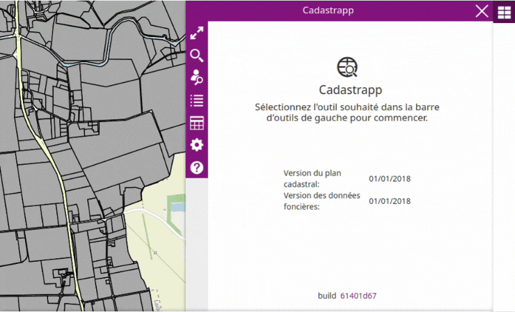
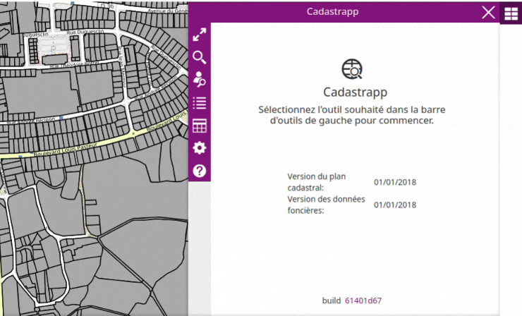
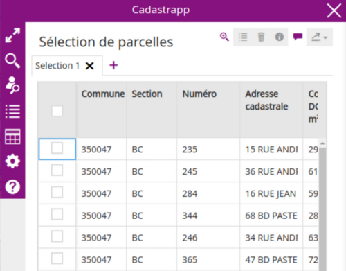
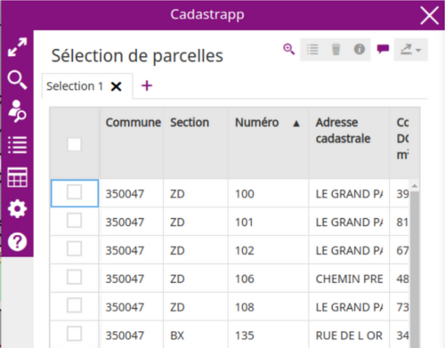
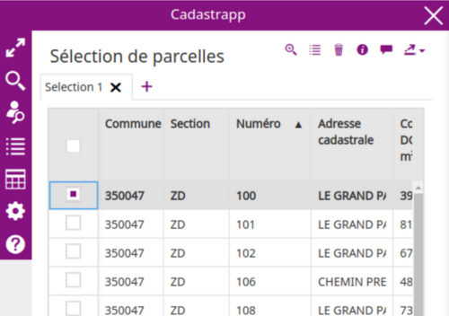
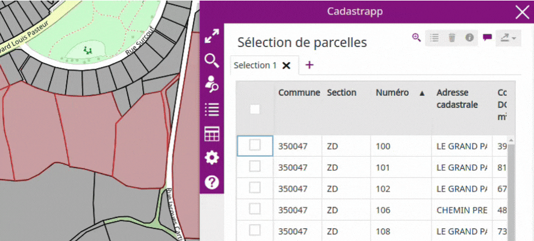

La recherche de copropriétaires s'obtient avec le bouton :

### Qu'est-ce qu'une copropriété ?

Lire [cette section](../preambule/#prioprietairecomptecommunal) pour comprendre la définition d'une copropriété.

### Les types de recherche possibles

Plusieurs types de recherche sont possibles en fonction des informations connues. Il faut, a minima, saisir la commune et un des éléments suivant :

- nom et/ou prénom d'un co-propriétaire 
- identifiant de la parcelle
- compte communal

### Recherche par nom et/ou prénom d'un copropriétaire

Après avoir choisi une commune, commencer à saisir le nom du co-propriétaire et le sélectionner dans la liste ou sortir de la liste des propositions  en appuyant sur le bouton « Echap » du clavier.

Valider la recherche en cliquant sur le bouton **Rechercher**

### Recherche par identifiant de la parcelle

Après avoir choisi une commune, saisir (ou copier-coller) l'identifiant de la parcelle.

Valider la recherche en cliquant sur le bouton **Rechercher**

### Recherche par compte communal

Après avoir choisi une commune, saisir (ou copier-coller) le compte communal.

Valider la recherche en cliquant sur le bouton **Rechercher**.

### Résultat d'une sélection

Lorsqu'une sélection est effectuée, la liste des parcelles apparaît dans le tableau "**Sélection de parcelles**".

Passer maintenant à la section détaillant la [manipulation des résultats des sélections](#manipulationresultatselection).

## Manipulation des résultats des sélections 

Lorsqu'une sélection est effectuée, par interaction avec la carte ou par utilisation des fonctions de recherche, une liste des parcelles apparaît dans le tableau "**Sélection de parcelles**" qui est située dans une zone en-dessous des outils de recherche.

Chaque ligne du tableau correspond à une parcelle sélectionnée sur la carte. Les informations affichées concernent la commune, la section cadastrale, l'adresse cadastrale, le numéro de la parcelle ainsi que la contenance DGFiP exprimée en m².

Il est possible de trier les parcelles sur l'une de ces informations en cliquant sur l'entête de la colonne.

Depuis cette liste, il est possible de zoomer sur tous les parcelles de la liste avec le bouton "**zoom liste**".

En cochant la case en début de ligne, la parcelle correspondante apparaît en sur-sélection sur la carte. Dans l'exemple ci-dessous la liste comprend 5 parcelles dont 1 est sur-sélectionnée.

**Une fois une (ou plusieurs) parcelle(s) sur-sélectionnée(s), les outils suivants sont rendus accessibles :**

De gauche à droite, ces boutons permettent :

- de recadrer la carte sur l'emprise correspondant à toutes les parcelles de la liste 

- d'afficher les informations sur l'unité foncière d'appartenance de la parcelle sélectionnée

- de supprimer la parcelle sélectionnée de la liste

- d'afficher la fiche d'information parcellaire dans une nouvelle fenêtre

- d'exporter dans un fichier CSV la sélection de :
  
  - parcelles
  - propriétaires
  - co-propriétaires
  - lots d'une co-propriété

La barre d'outils placée juste au-dessus de la liste est composée des 2 outils suivants, permettant de supprimer un onglet de résultat de sélection ou d'en ajouter un.

