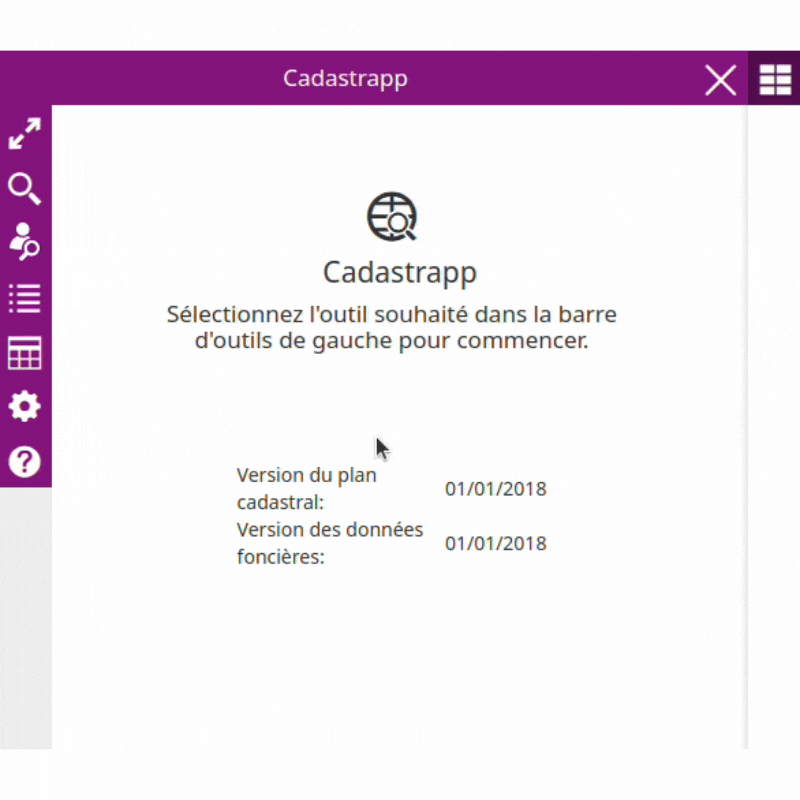
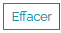
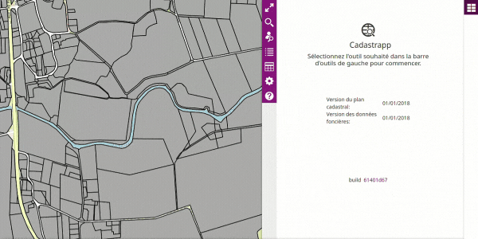
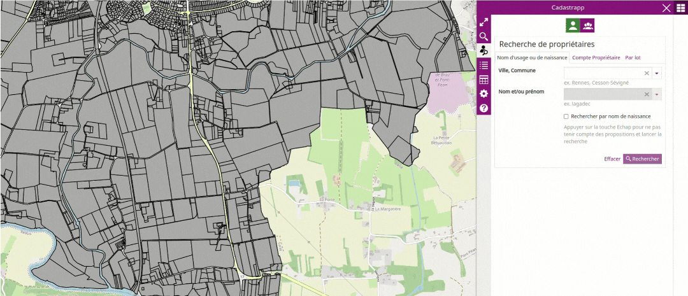
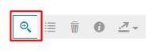
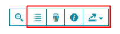

# Sélection et recherche

## Sélection de parcelles depuis la carte

La sélection d'une parcelle dans la carte peut s'effectuer avec l'un des trois outils suivants :

### Sélection par un point

Lorsque l'outil est actif, il apparait sur fond vert. 

L'outil sélection d'une parcelle par simple clic permet de sélectionner une parcelle à chaque clic dans la carte. La liste des parcelles sélectionnées apparait dans le panneau à droite de l'écran sous forme de tableau.

### Sélection par une polyligne

--------------------------------------

Lorsque l'outil de sélection par une polyligne est actif, il apparait sur fond vert. 

Il s'agit de tracer une ligne brisée, toutes les parcelles coupées par cette polyligne seront sélectionnées.
Pour arrêter le tracé de la polyligne il faut faire un double clic.
La sélection peut-être complétée en dessinant une nouvelle polyligne. Les parcelles seront ajoutées à la selection obtenue précédemment. Les parcelles vont ainsi s'ajouter dans le tableau "**Sélection de parcelles**" du panneau droit.

### Sélection par un polygone

Lorsque l'outil de sélection par une polygone est actif, il apparait sur fond vert. 

L'outil de sélection d'une parcelle par un polygone permet de dessiner une surface et de sélectionner toutes les parcelles ayant un point commun avec cette forme.
Le dessin d'un autre polygone completera la première sélection de parcelles dans le tableau de "**Sélection de parcelles**".

### Résultat d'une sélection

--------------------------------------

Lorsqu'une sélection est effectuée, la liste des parcelles apparaît dans le tableau "**Sélection de parcelles**"

Passer maintenant à la section détaillant la [manipulation des résultats des sélections](#manipulationresultatselection).

## Recherche de parcelles

La recherche de parcelle s'active avec le bouton :

Il est possible d'effectuer des recherches selon les critères suivants :

- Référence cadastrale
- Adresse cadastrale
- Identifiant cadastral
- Lot

Choisir l'onglet correspondant aux éléments disponibles pour la recherche.

### Par référence cadastrale

Depuis l'onglet **Référence**, il faut d'abord choisir la commune, puis la section puis la parcelle.

Pour la saisie de la **ville / de la commune**, il est nécéssaire d'écrire à minima les 3 premiers caractères du nom de la commune. Une liste déroulante affiche les noms de communes ainsi que leur code INSEE.

Les majuscules n'ont pas d'importance, par contre les tirets, les espaces et les apostrophes ont une importance car ils sont pris en compte dans la recherche.

Une fois la commune de recherche sélectionnée dans la liste déroulante, choisir la section dans la liste puis le numéro de la parcelle. Enfin, cliquer sur le bouton **Rechercher**.

Il est possible d'ajouter d'autres recherches avec le bouton **+**. La corbeille permet d'effacer une des recherches.

Enfin en cliquant sur **Effacer**, l'onglet de recherche par référence est réinitialisé, les valeurs prédemment saisies sont effacées.

### Par adresse cadastrale

/!\ **Attention il s'agit bien ici d'une recherche dans les données cadastrales** fournies par la DGFiP. La plupart du temps la fraîcheur de ces informations est en retard par rapport à d'autres sources de données. Plus particulièrement les référentiels voies-adresses locaux, la Base Adresse Nationale. Votre plate-forme geOrchestra propose peut-être des recherches utilisant ces données plus à jour.

Depuis l'onglet **Adresse cadastrale**, il faut d'abord saisir le nom de la commune ou de la ville. Après avoir saisi les 3 premiers caractères du nom,  une liste déroulante permet de choisir la commune. Le code INSEE de la commune permet d'affiner son choix, si nécessaire.

Ensuite commencer la saisie du nom de la voie ou du lieu-dit, **il s'agit ici de saisir le mot directeur** (ex : « mairie »), et de choisir ensuite dans la liste déroulante. Il ne faut pas commencer par saisir le type de la voie.

Il est possible d'affiner la recherche en indiquant le numéro dans la voie ou une information complémentaire.

Enfin cliquer sur le bouton **Rechercher**.

### Par identifiant cadastral

L'onglet **Identifiant cadastral** permet de sélectionner une parcelle depuis son identifiant cadastral.

L'identifiant cadastral contient 19 caractères structuré comme suit :

* code de département sur 2 caractères. Ex : « 35 »
* code de direction DGFiP sur 1 caractère. Ex : « 0 »
* code de commune sur 3 caractères. Ex : « 238 »
* préfixe de section sur 3 caractères. Ex : « 000 »
* section sur 2 caractères. Ex : « AB »
* parcelle sur 4 caractères. Ex : « 0145 »

Terminer en  cliquant sur le bouton **Rechercher**.

### Par lot

L'onglet **Lot** permet de sélectionner un ensemble de parcelle depuis une liste d'identifiants cadastraux.

Il est possible soit :

- de saisir les identifiants en les séparant par une virgule dans **Liste d'identifiants**
- de déposer ou de pointer vers un fichier au format txt ou csv comprenant une liste d'identifiants cadastraux séparés par des virgules, des espaces, des points-virgules ou des retours à la ligne.

### Résultat d'une sélection

Lorsqu'une sélection est effectuée, la liste des parcelles apparaît dans le tableau "**Sélection de parcelles**".

Passer maintenant à la section détaillant la [manipulation des résultats des sélections](#manipulationresultatselection).

## Recherche de parcelles à partir des propriétaires

La recherche de propriétaires s'obtient avec le bouton :

Plusieurs types de recherche sont possibles en fonction des informations connues : 

- nom du propriétaire : nom d'usage ou nom de naissance
- compte propriétaire
- une liste de comptes propriétaires

Á chacune de ces possibilités correspond un onglet différent.

### Propriétaire -> compte communal

Lire [cette section](../preambule/#prioprietairecomptecommunal) pour comprendre la différence entre un propriétaire et un compte communal.

### Recherche par le nom du propriétaire

#### Cas simple

Il faut d'abord saisir le nom de la commune sur laquelle effectuer la recherche grâce à la liste déroulante.

Saisir ensuite le nom et / ou le prénom du propriétaire recherché. **Une liste de suggestions apparaît. Elle est affinée à chaque caractère supplémentaire saisi.**

Si le nom du propriétaire désiré apparaît : le sélectionner puis valider la recherche en cliquant sur le bouton **Rechercher**.

Vous pouvez ré-initialiser la fenêtre de recherche en cliquant sur le bouton **Effacer**

#### Cas des homonymies / Sortie de la recherche assistée

Si vous ne trouvez pas / pas facilement le propriétaire recherché dans la liste déroulante, vous pouvez sortir du mode assisté de la liste en appuyant sur le bouton « Echap » du clavier.

Valider ensuite la recherche en cliquant sur le bouton **Rechercher**.

Une nouvelle fenêtre va s'ouvrir. Elle présente la liste des propriétaires correspondant à la chaîne de caractères recherchée.

Il faut ensuite sélectionner le propriétaire souhaité puis cliquer sur **Voir les parcelles**.

Vous pouvez ré-initialiser la fenêtre de recherche en cliquant sur le bouton **Effacer**

### Recherche par le compte propriétaire

Depuis l'onglet Compte Propriétaire, il faut commencer par saisir le nom de la commune sur laquelle effectuer la recherche,  puis le compte propriétaire.

Le compte propriétaire correspond à 6 caractères avec le premier caractère qui est soit une lettre s'il s'agit d'une personne physique soit un "+" ou une "*" pour les personnes morales. Les 5 autres caractères correspondent à un numéro d'ordre.

Valider la recherche en cliquant sur le bouton **Rechercher**

Vous pouvez effectuer la recherche sur plusieurs comptes propriétaires en cliquant sur le bouton + pour ajouter une nouvelle zone de saisie.

Vous pouvez ré-initialiser la fenêtre de recherche en cliquant sur le bouton **Effacer**

### Recherche par lot

Pour effectuer une recherche par lot, vous devez disposer dans un fichier CSV d'une liste de comptes communaux (code de la commune et compte communal). Le séparateur de champs (séparateur de colonnes) peut être au choix :

- des retours à ligne
- des espaces
- des virgules
- des points-virgules

Il suffit ensuite de faire glisser votre fichier texte dans l'onglet **Par lot** ou de cliquer dans l'espace pour  ouvrir une boite de dialogue et de naviguer jusqu'au fichier texte à pointer.

Valider la recherche en cliquant sur le bouton **Rechercher**

Vous pouvez ré-initialiser la fenêtre de recherche en cliquant sur le bouton **Effacer**

### Résultat d'une sélection

Lorsqu'une sélection est effectuée, la liste des parcelles apparaît dans le tableau "**Sélection de parcelles**"

Passer maintenant à la section détaillant la [manipulation des résultats des sélections](#manipulationresultatselection).

Recherche de parcelles à partir des copropriétaires
===================================================

La recherche de copropriétaires s'obtient avec le bouton :

### Qu'est-ce qu'une copropriété ?

Lire [cette section](../preambule/#prioprietairecomptecommunal) pour comprendre la définition d'une copropriété.

### Les types de recherche possibles

Plusieurs types de recherche sont possibles en fonction des informations connues. Il faut, a minima, saisir la commune et un des éléments suivant :

- nom et/ou prénom d'un co-propriétaire 
- identifiant de la parcelle
- compte communal

### Recherche par nom et/ou prénom d'un copropriétaire

Après avoir choisi une commune, commencer à saisir le nom du co-propriétaire et le sélectionner dans la liste ou sortir de la liste des propositions  en appuyant sur le bouton « Echap » du clavier.

Valider la recherche en cliquant sur le bouton **Rechercher**

### Recherche par identifiant de la parcelle

Après avoir choisi une commune, saisir (ou copier-coller) l'identifiant de la parcelle.

Valider la recherche en cliquant sur le bouton **Rechercher**

### Recherche par compte communal

Après avoir choisi une commune, saisir (ou copier-coller) le compte communal.

Valider la recherche en cliquant sur le bouton **Rechercher**.

### Résultat d'une sélection

Lorsqu'une sélection est effectuée, la liste des parcelles apparaît dans le tableau "**Sélection de parcelles**".

Passer maintenant à la section détaillant la [manipulation des résultats des sélections](#manipulationresultatselection).

## Manipulation des résultats des sélections 

Lorsqu'une sélection est effectuée, par interaction avec la carte ou par utilisation des fonctions de recherche, une liste des parcelles apparaît dans le tableau "**Sélection de parcelles**" qui est située dans une zone en-dessous des outils de recherche.

Chaque ligne du tableau correspond à une parcelle sélectionnée sur la carte. Les informations affichées concernent la commune, la section cadastrale, l'adresse cadastrale, le numéro de la parcelle ainsi que la contenance DGFiP exprimée en m².

Il est possible de trier les parcelles sur l'une de ces informations en cliquant sur l'entête de la colonne.

Depuis cette liste, il est possible de zoomer sur tous les parcelles de la liste avec le bouton "**zoom liste**".

En cochant la case en début de ligne, la parcelle correspondante apparaît en sur-sélection sur la carte. Dans l'exemple ci-dessous la liste comprend 5 parcelles dont 1 est sur-sélectionnée.

**Une fois une (ou plusieurs) parcelle(s) sur-sélectionnée(s), les outils suivants sont rendus accessibles :**

De gauche à droite, ces boutons permettent :

- de recadrer la carte sur l'emprise correspondant à toutes les parcelles de la liste 

- d'afficher les informations sur l'unité foncière d'appartenance de la parcelle sélectionnée

- de supprimer la parcelle sélectionnée de la liste

- d'afficher la fiche d'information parcellaire dans une nouvelle fenêtre

- d'exporter dans un fichier CSV la sélection de :
  
  - parcelles
  - propriétaires
  - co-propriétaires
  - lots d'une co-propriété

La barre d'outils placée juste au-dessus de la liste est composée des 2 outils suivants, permettant de supprimer un onglet de résultat de sélection ou d'en ajouter un.

