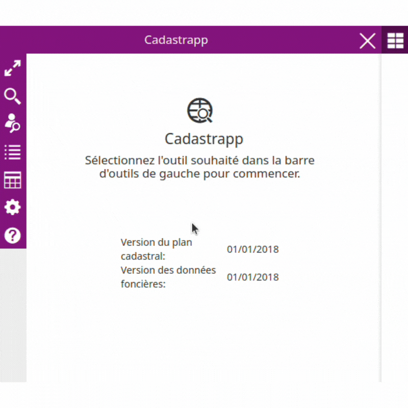
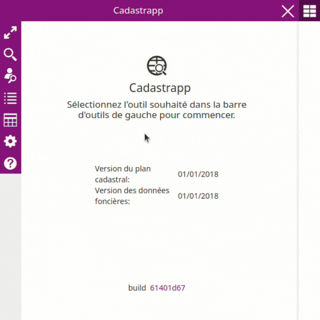
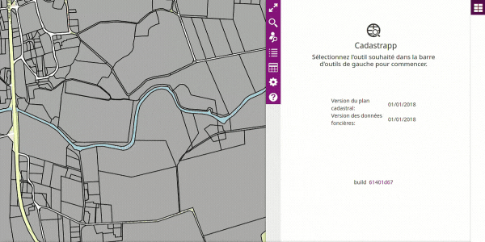

La recherche de parcelle s'active avec le bouton :

Il est possible d'effectuer des recherches selon les critères suivants :

- Référence cadastrale
- Adresse cadastrale
- Identifiant cadastral
- Lot

Choisir l'onglet correspondant aux éléments disponibles pour la recherche.

### Par référence cadastrale

Depuis l'onglet **Référence**, il faut d'abord choisir la commune, puis la section puis la parcelle.

Pour la saisie de la **ville / de la commune**, il est nécéssaire d'écrire à minima les 3 premiers caractères du nom de la commune. Une liste déroulante affiche les noms de communes ainsi que leur code INSEE.

Les majuscules n'ont pas d'importance, par contre les tirets, les espaces et les apostrophes ont une importance car ils sont pris en compte dans la recherche.

Une fois la commune de recherche sélectionnée dans la liste déroulante, choisir la section dans la liste puis le numéro de la parcelle. Enfin, cliquer sur le bouton **Rechercher**.

Il est possible d'ajouter d'autres recherches avec le bouton **+**. La croix permet d'effacer une des recherches.

Enfin en cliquant sur **Effacer**, l'onglet de recherche par référence est réinitialisé, les valeurs prédemment saisies sont effacées.

### Par adresse cadastrale

/!\ **Attention il s'agit bien ici d'une recherche dans les données cadastrales** fournies par la DGFiP. La plupart du temps la mise à jour de ces informations est tardive par rapport à d'autres sources de données. Plus particulièrement les référentiels voies-adresses locaux, la Base Adresse Nationale. Votre plate-forme geOrchestra propose peut-être des recherches utilisant ces données plus à jour.

Depuis l'onglet **Adresse cadastrale**, il faut d'abord saisir le nom de la commune ou de la ville. Après avoir saisi les 3 premiers caractères du nom, une liste déroulante permet de choisir la commune. Le code INSEE de la commune permet d'affiner son choix, si nécessaire.

Ensuite, commencer la saisie du nom de la voie ou du lieu-dit. **Il s'agit ici de saisir le mot directeur** (exemple : « mairie »), et de choisir ensuite dans la liste déroulante. Il ne faut pas commencer par saisir le type de la voie.

Il est possible d'affiner la recherche en indiquant le numéro dans la voie ou une information complémentaire.

Enfin, cliquer sur le bouton **Rechercher**.

### Par identifiant cadastral

L'onglet **Identifiant cadastral** permet de sélectionner une parcelle depuis son identifiant cadastral.

L'identifiant cadastral contient 19 caractères structuré comme suit :

* code de département sur 2 caractères. Ex : « 35 »
* code de direction DGFiP sur 1 caractère. Ex : « 0 »
* code de commune sur 3 caractères. Ex : « 238 »
* préfixe de section sur 3 caractères. Ex : « 000 »
* section sur 2 caractères. Ex : « AB »
* parcelle sur 4 caractères. Ex : « 0145 »

Terminer en  cliquant sur le bouton **Rechercher**.

### Par lot

L'onglet **Lot** permet de sélectionner un ensemble de parcelle depuis une liste d'identifiants cadastraux.

Il est possible soit :

- de saisir les identifiants en les séparant par une virgule dans **Liste d'identifiants**
- de déposer ou de pointer vers un fichier au format txt ou csv comprenant une liste d'identifiants cadastraux séparés par des virgules, des espaces, des points-virgules ou des retours à la ligne.

### Résultat d'une sélection

Lorsqu'une sélection est effectuée, la liste des parcelles apparaît dans le tableau "**Sélection de parcelles**". Voir la partie [Afficher les résultats de recherche et les manipuler](../manipulation_resultats/) pour plus d'information sur la manipulation de ces résultats.