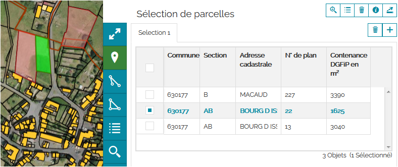
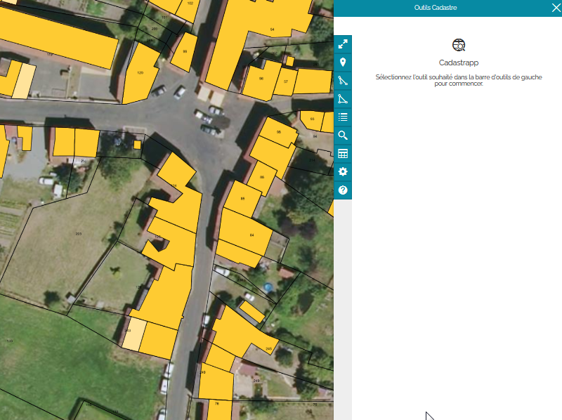

Sélection de parcelles depuis la carte
======================================
La sélection d'une parcelle dans la carte peut s'effectuer avec l'un des trois outils suivants :

 .. image::  _images/selection_carte_1.png

Sélection par un point
--------------------------------------
Lorsque l'outil est actif, il apparait sur fond vert. 

L'outil sélection d'une parcelle par simple clic permet de sélectionner une parcelle à chaque clic dans la carte. La liste des parcelles sélectionnées apparait dans le panneau à droite de l'écran sous forme de tableau.

Sélection par une polyligne
--------------------------------------
Lorsque l'outil de sélection par une polyligne est actif, il apparait sur fond vert. 

Il s'agit de tracer une ligne brisée, toutes les parcelles coupées par cette polyligne seront sélectionnées.
Pour arrêter le tracé de la polyligne il faut faire un double clic.
La sélection peut-être complétée en dessinant une nouvelle polyligne. Les parcelles seront ajoutées à la selection obtenue précédemment. Les parcelles vont ainsi s'ajouter dans le tableau "**Sélection de parcelles**" du panneau droit.

Sélection par un polygone
--------------------------------------
Lorsque l'outil de sélection par une polygone est actif, il apparait sur fond vert. 

L'outil de sélection d'une parcelle par un polygone permet de dessiner une surface et de sélectionner toutes les parcelles ayant un point commun avec cette forme.
Le dessin d'un autre polygone completera la première sélection de parcelles dans le tableau de "**Sélection de parcelles**".

Résultat d'une sélection
--------------------------------------
Lorsqu'une sélection est effectuée, la liste des parcelles apparaît dans le tabeau "**Sélection de parcelles**"

Passer maintenant à la page détaillant la `manipulation des résultats des sélections <resultat_selection.html>`_.

