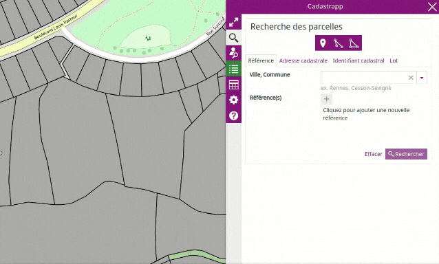

# Unité foncière

Voir la définition sur [cette page](/guide_utilisateur/preambule/#unite-fonciere).

## Unité foncière depuis les outils principaux

Pour identifier l'unité foncière correspondant à une parcelle, il est nécessaire d'activer l'outil d'information foncière.

Cliquer ensuite dans la carte sur une parcelle.

Une nouvelle fenêtre **Unité foncière** apparaît. Elle permet de visualiser l'ensemble de(s) parcelle(s) composant l'unité foncière, de lister les identifiants cadastraux des différentes parcelles ainsi que leur contenance et le pourcentage de surface bâtie.

Le nom du propriétaire ainsi que l'identifiant du compte propriétaire apparaissent seulement si vous avez [accès aux données nominatives ](../preambule/#controleniveauaccesdonneesfiscales).

En pied de page, il est précisé les dates de fraîcheur des données du plan et de la matrice cadastrale.

  

Il est possible d'**Imprimer** directement le document Information sur l'unité foncière.

## Unité foncière depuis une sélection

Après une sélection graphique ou une recherche, il est possible de cocher une ligne du tableau sélection de parcelles et d'afficher l'unité foncière correspondante depuis le bouton : 

