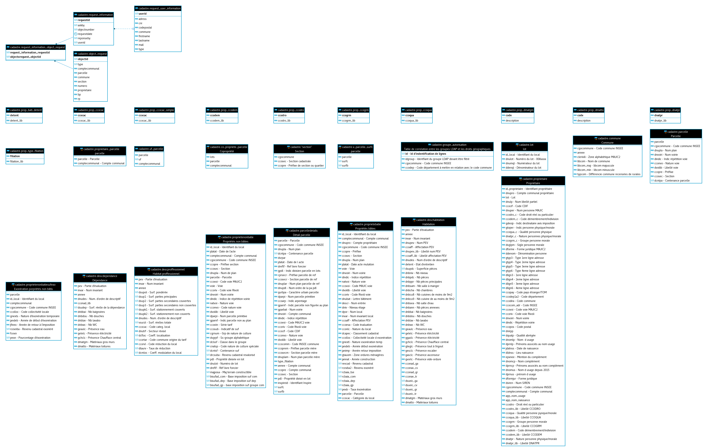

# Les données utilisées par l'application

TODO

doublon avec `données dans guide installation <../guide_installation/donnees.html>`_ ?

Modèle de données
------------------

/!\ version 2019 à mettre à jour

