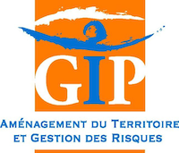
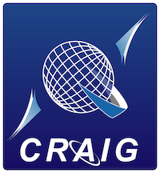

# Accueil

## C'est quoi ?

Cadastrapp est l’outil de consultation des données cadastrales. Cet outil prend la forme d'un greffon (plugin) dans le visualiseur MapStore2 de [geOrchestra](https://www.georchestra.org/).

 

[Freepik](https://fr.freepik.com/photos-gratuite/joyeux-collegues-utilisant-ordinateurs-portables_2317379.htm#query=people%20working%20office)

Cadastrapp est l’outil de consultation des données cadastrales fournies par la Direction Générale des Finances Publiques (DGFiP) dans le visualiseur de geOrchestra. Il est composé d’un module serveur qui est une API d’accès aux données de la matrice foncière et d’un add-on au visualiseur de geOrchestra. l'API peut être utilisée par n'importe quelle application client sous réserve de passer par le système d'authentification de geOrchestra.

Cette documentation comporte trois parties :

* un guide utilisateur qui détaille toute les fonctionnalités de l'application
* un guide administrateur pour l'installation et la configuration (guides techniques)
* un guide développeur pour identifier les méthodes de l'API (guides techniques)

|   |   |
|---|---|
|Agglomération le Puy-en-Velay|  |
|Aménagement du territoire et gestion des risques|  |
|Conseil départemental du Bas-Rhin ||
|CRAIG : Centre Régional Auvergnat de l'Information Géographique Union européenne en Auvergne||
|Rennes Métropole||

## Aide et support

Posez vos questions sur la liste de discussion via un courriel adressé à [georchestra@googlegroups.com](mailto:georchestra@googlegroups.com) ou via [ce site](https://groups.google.com/g/georchestra?hl=fr).

## Remerciements

La réalisation de ce guide a été rendue possible grâce à la contribution de la communauté des administrateurs et utilisateur de Cadastrapp.

Nous tenons à les remercier pour leur participation active et leur aide précieuse.