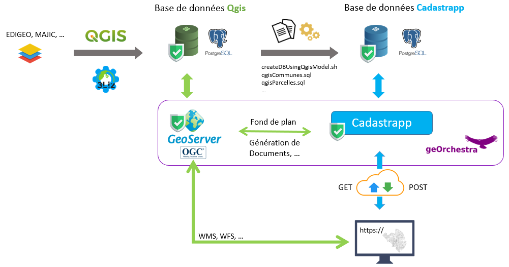

.. Cadastrapp documentation master file, created by
   sphinx-quickstart on Fri May 15 16:05:20 2020.
   You can adapt this file completely to your liking, but it should at least
   contain the root `toctree` directive.

À propos de Cadastrapp
======================

Cadastrapp est l’outil de consultation des données cadastrales fournies par la Direction Générale des Finances Publiques (DGFiP) dans le visualiseur de `geOrchestra <https://www.georchestra.org/fr/projet.html/>`_. Il est composé d’un module serveur qui est une API d’accès aux données de la matrice foncière et d’un add-on au visualiseur de geOrchestra. l'API peut être utilisée par n'importe quelle application client sous réserve de passer par le système d'authentification de geOrchestra.

Cette documentation comporte trois parties :

* un guide utilisateur qui détaille toute les fonctionnalités de l'application
* un guide administrateur pour l'installation et la configuration
* un guide développeur pour identifier les méthodes de l'API

Table des matières
==================

.. toctree::
   :maxdepth: 3

   guide_utilisateur/index
   guide_administrateur/index
   guide_developpeur/index

Sponsors
========

+----------------------------------------------------+----------------------------------------------------+
| Agglomération le Puy-en-Velay                      |  .. image:: _images/logo_lepuy.png                 |
+----------------------------------------------------+----------------------------------------------------+
| Aménagement du territoire et gestion des risques   |  .. image:: _images/logo_gip_atgeri.png            |
+----------------------------------------------------+----------------------------------------------------+
| Conseil départemental du Bas-Rhin                  |  .. image:: _images/logo_bas_rhin.png              |
+----------------------------------------------------+----------------------------------------------------+
| CRAIG : Centre Régional Auvergnat                  |  .. image:: _images/logo_craig.png                 |
| de l'Information Géographique                      |                                                    |
+----------------------------------------------------+----------------------------------------------------+
| Union européenne en Auvergne.                      |  .. image:: _images/logo_europe_sengage.png        |
+----------------------------------------------------+----------------------------------------------------+
| Rennes Métropole                                   |  .. image:: _images/logo_rennes_metropole.png      |
+----------------------------------------------------+----------------------------------------------------+

Aide et support
=================

Posez vos questions sur la liste de diffusion georchestra@googlegroups.com

